# Android Studio 的安装与使用

官方下载链接：[下载 Android Studio 和应用工具 - Android 开发者  | Android Developers (google.cn)](https://developer.android.google.cn/studio?hl=ru)

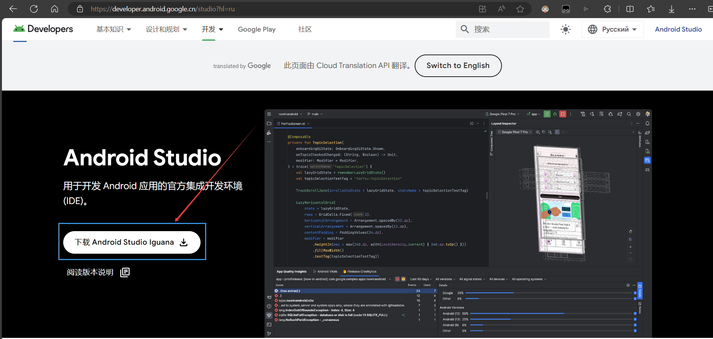

因为之前已经安装过 Android Studio ，就不重复安装了，安装过程可参考网上教程。下面演示创建项目。

1. 找到用户目录下 .gradle 目录中的init.gradle文件，修改 gradle 配置，配置使用阿里云云效 Maven 。

   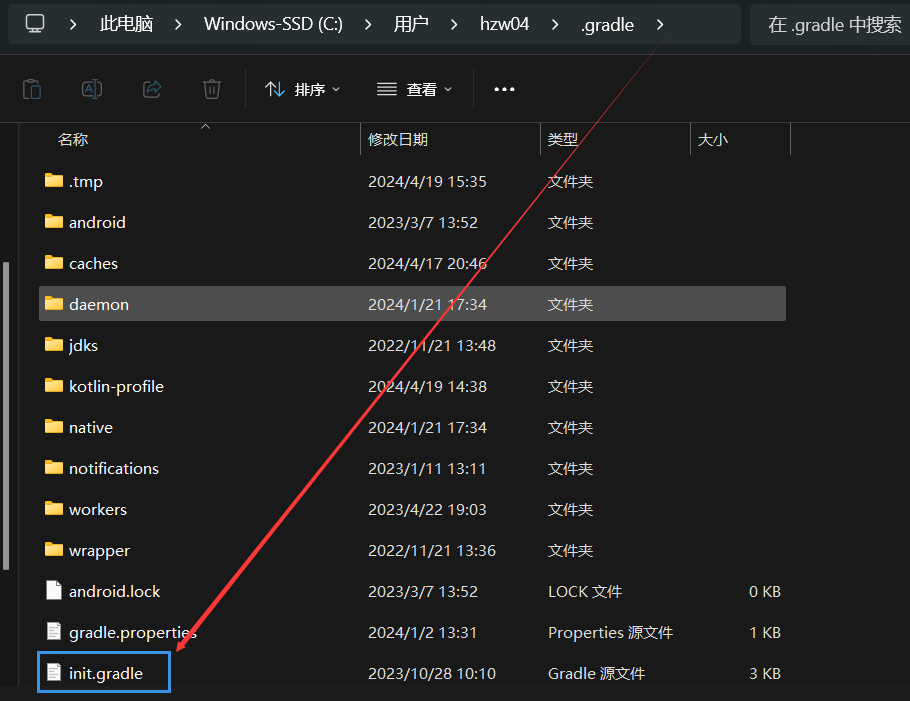

   内容替换为（参考自网上教程）：

   ```
   allprojects{
       repositories {
           def ALIYUN_REPOSITORY_URL = 'https://maven.aliyun.com/repository/central'
           def ALIYUN_JCENTER_URL = 'https://maven.aliyun.com/repository/public'
           all { ArtifactRepository repo ->
               if(repo instanceof MavenArtifactRepository){
                   def url = repo.url.toString()
                   if (url.startsWith('https://repo1.maven.org/maven2') || url.startsWith('http://repo1.maven.org/maven2')) {
                       project.logger.lifecycle "Repository ${repo.url} replaced by $ALIYUN_REPOSITORY_URL."
                       remove repo
                   }
                   if (url.startsWith('https://jcenter.bintray.com/') || url.startsWith('http://jcenter.bintray.com/')) {
                       project.logger.lifecycle "Repository ${repo.url} replaced by $ALIYUN_JCENTER_URL."
                       remove repo
                   }
               }
           }
           maven {
               url ALIYUN_REPOSITORY_URL
               url ALIYUN_JCENTER_URL
           }
       }
    
    
       buildscript{
           repositories {
           def ALIYUN_REPOSITORY_URL = 'https://maven.aliyun.com/repository/central'
           def ALIYUN_JCENTER_URL = 'https://maven.aliyun.com/repository/public'
               all { ArtifactRepository repo ->
                   if(repo instanceof MavenArtifactRepository){
                       def url = repo.url.toString()
                       if (url.startsWith('https://repo1.maven.org/maven2') || url.startsWith('http://repo1.maven.org/maven2')) {
                           project.logger.lifecycle "Repository ${repo.url} replaced by $ALIYUN_REPOSITORY_URL."
                           remove repo
                       }
                       if (url.startsWith('https://jcenter.bintray.com/') || url.startsWith('http://jcenter.bintray.com/')) {
                           project.logger.lifecycle "Repository ${repo.url} replaced by $ALIYUN_JCENTER_URL."
                           remove repo
                       }
                   }
               }
               maven {
                   url ALIYUN_REPOSITORY_URL
                   url ALIYUN_JCENTER_URL
               }
           }
       }
   }
   ```

2. 打开 Android Studio ，点击新建 Empty Activity 项目，修改项目名、包名、项目路径等，点击完成。

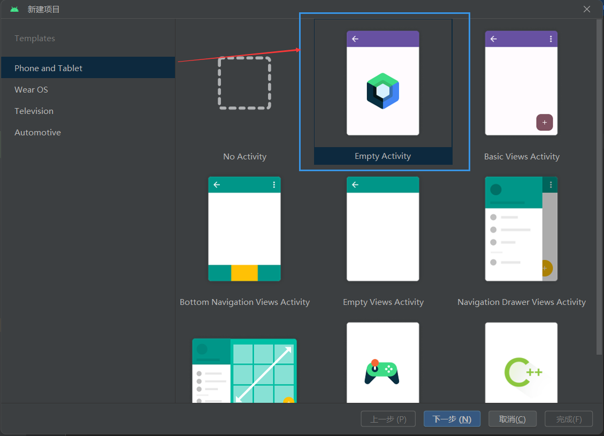

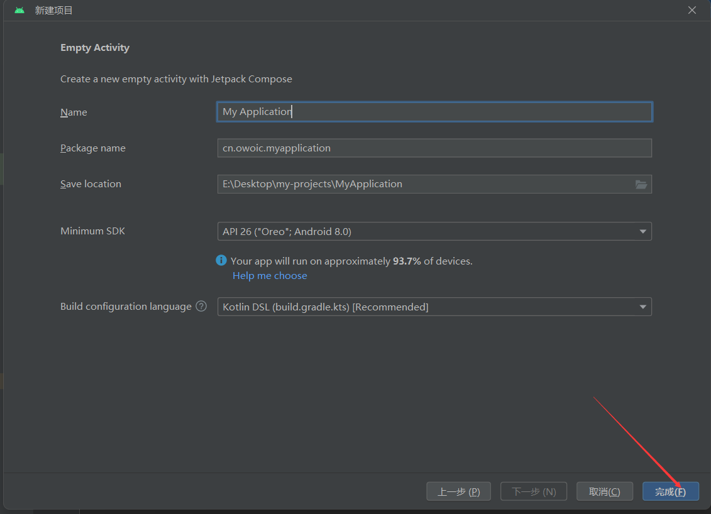

3. 项目创建完毕，自动进入代码编辑界面

   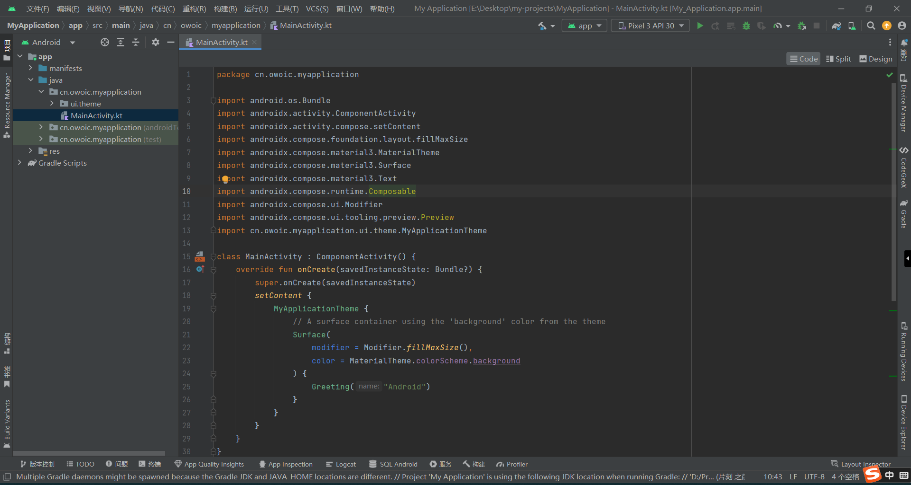

4. 点击运行键，运行程序，在模拟器中就能看到相应的APP界面。

   

   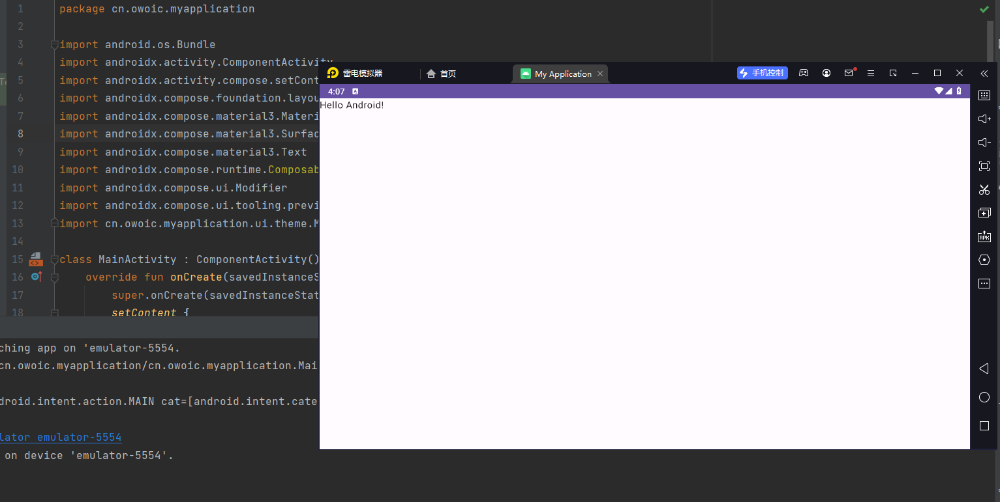

# anaconda的安装

## 访问anaconda官网下载anaconda

anaconda官网链接：[Unleash AI Innovation and Value | Anaconda](https://www.anaconda.com/)


点击 Free Download 进入新页面，点击 Skip registration 直接进入下载页。


进入下载页，选择需要下载的版本进行下载。

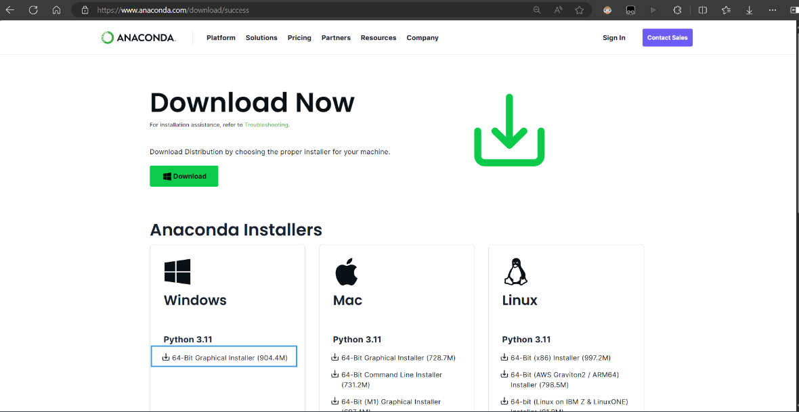

## 安装anaconda

1. 点击 Next 。


2. 点击 I Agree 。


3. 选择 Just Me ，点击 Next 。

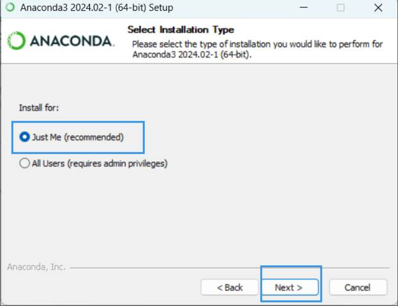

4. 选择安装路径，路径中不要有中文和空格。点击 Next 。


5. 勾选图中的第一个和第三个选项，允许创建开始菜单的快捷键、使用 Anaconda 作为默认 Python 环境，点击 Install 。


6. 等待安装完毕，然后点击 Next 。

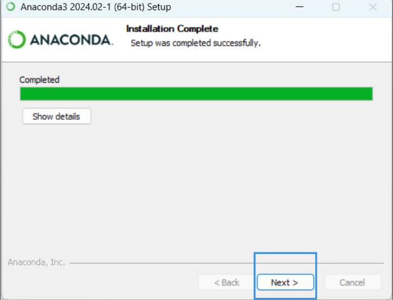

7. 点击 Next 。


8. 图中两个选项可以不选，点击 Finish。

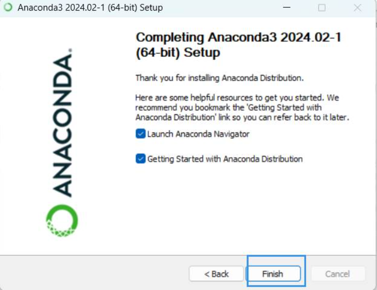

## 验证是否安装成功

- 开 始 → Anaconda3 （64-bit ） → Anaconda Navigator(anaconda3)，启动成功说明安装成功。

  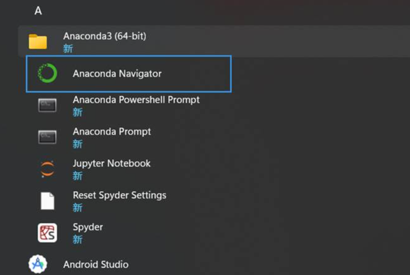

  

- 开始 → Anaconda3（64-bit）→ 右键点击Anaconda Prompt→ 以“管理员身份运行” ，在Anaconda Prompt中输入 conda

list ，可以查看已经安装的包名和版本号。若结果可以正常显示，则说明安装成功。

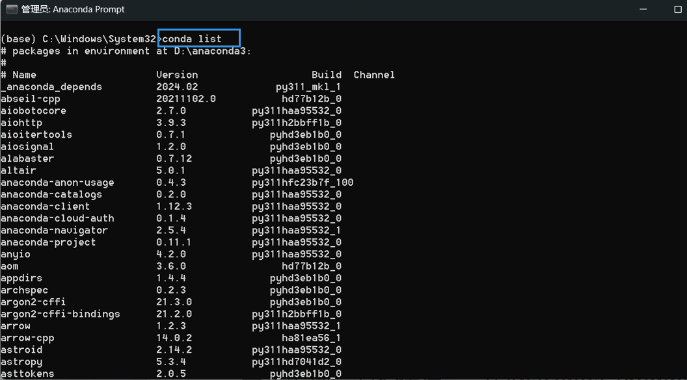

# Jupyter Notebook 的基本配置与使用

1. 在 Anaconda Navigator 中点击 Notebook 下的 launch 按钮启动 Notebook 。

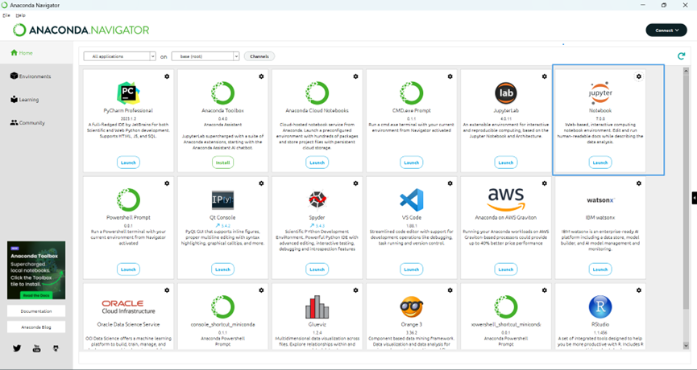

2. 启动后就进入了 Jupyter Notebook 网页，此时默认的Files列出了用户文件夹的项目

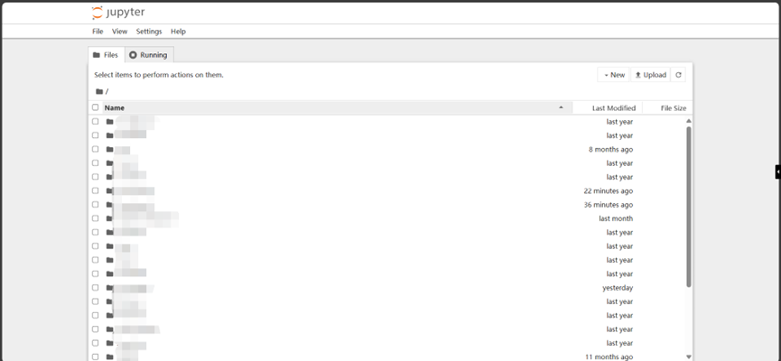

3. 更改默认加载的目录（如有需要）

   - 在 Anaconda Powershell Prompt 中输入 jupyter notebook --generate-config 生成配置文件。

     

   - 找到上图中给定路径的配置文件，打开该文件，查找 “ notebook_dir ” 所在位置。

     

   - 将这一行的注释符 “ # ” 删掉，然后将等于号后面的改为需要设置的默认路径，保存后关闭。

     

   - 打开开始菜单中 Jupyter Notebook 快捷方式的所在位置

     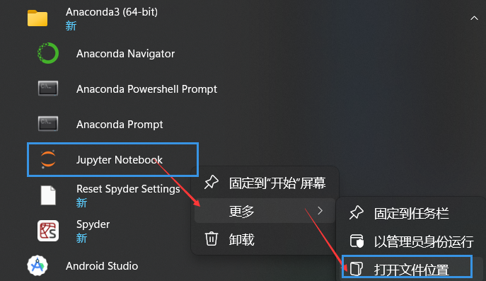

   - 右键快捷方式打开属性，修改快捷方式的目标，将后面引号部分的内容删去，然后点击确定。

     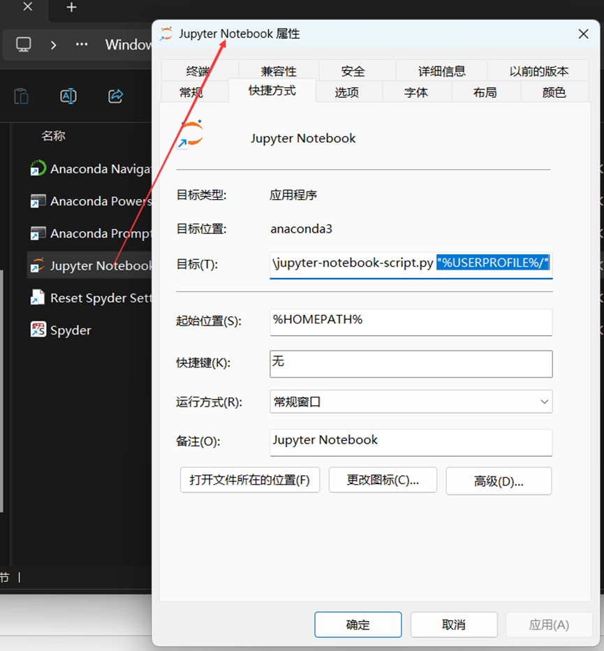

   - 重新运行 Jupyter Notebook ， 看到默认目录已切换。

     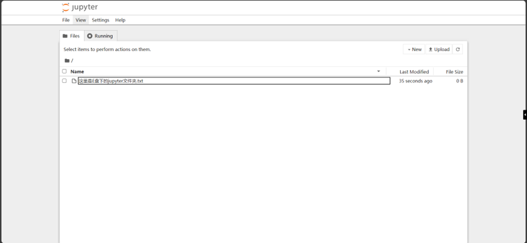

4. 新建 Notebook 。

   

   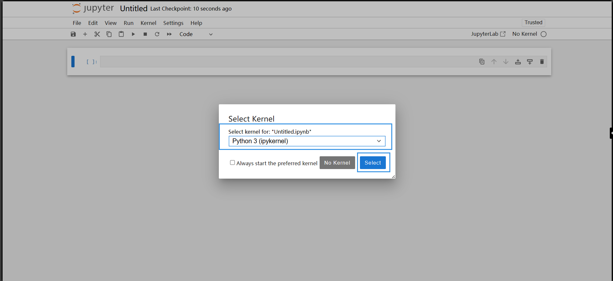

5. 输入简单的 Python 语句进行测试，然后点击运行，看到输出语句。

   

   

   

# vscode 的安装及使用

1. 在 Anacoda Navigator 中安装 VS Code（或者自己通过VS Code官网下载），然后点击Launch。

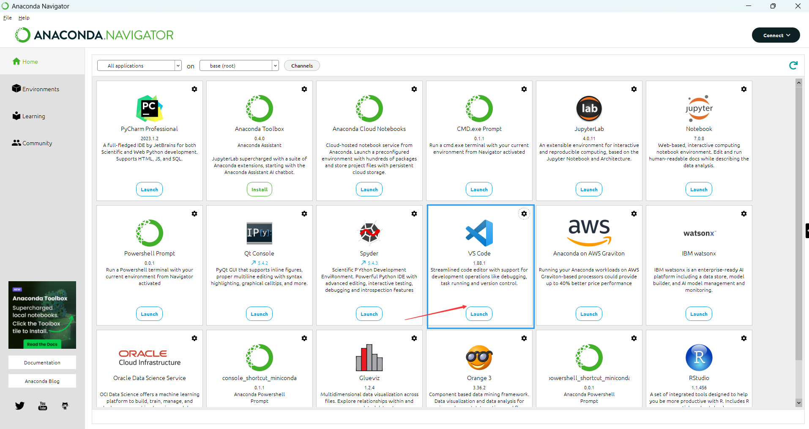

2. 新建笔记本。

   

3. 选择 Anaconda 内核。

   

   

   

   

4. 编写代码。

   

5. 点击代码前的运行按钮，运行程序，查看输出。

   