# **构建第一个Kotlin应用**

## 1.创建一个新项目

打开Android Studio，点击New Project

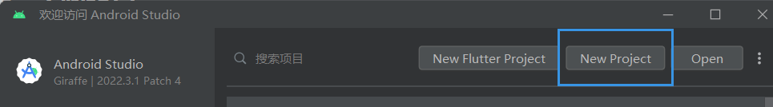

选择Basic Views Activity，点击下一步

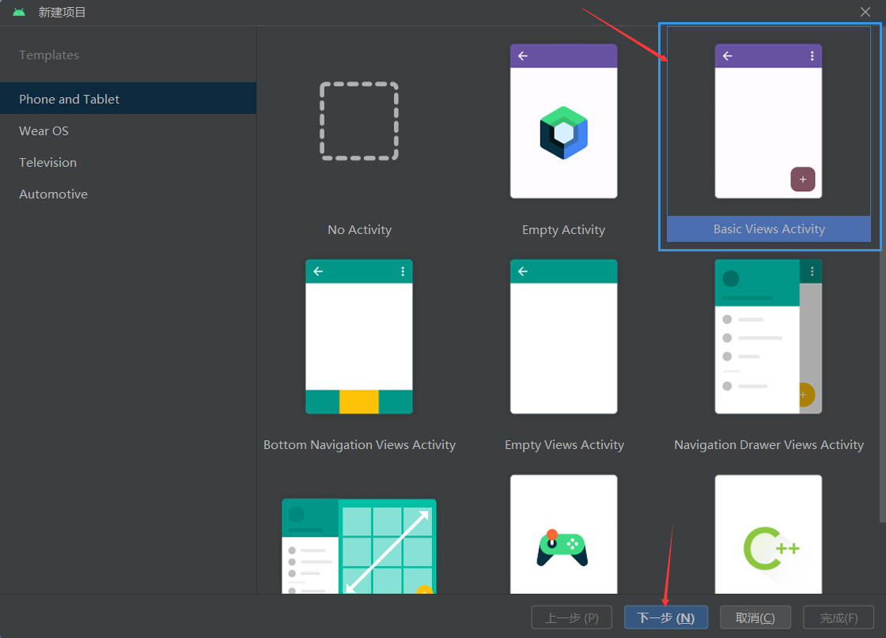

填写项目名称、路径等，选择kotlin，点击完成。

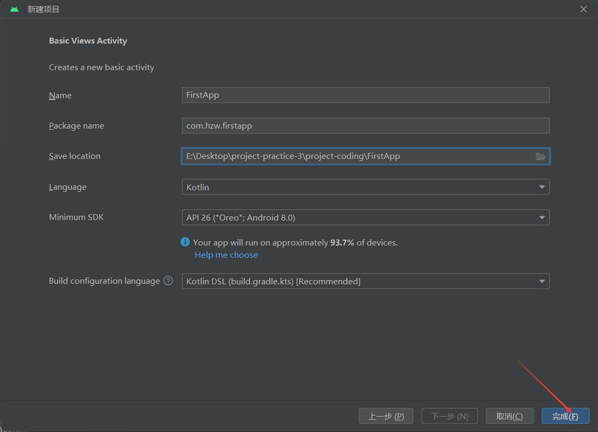

选择模拟器后点击右侧的运行按钮

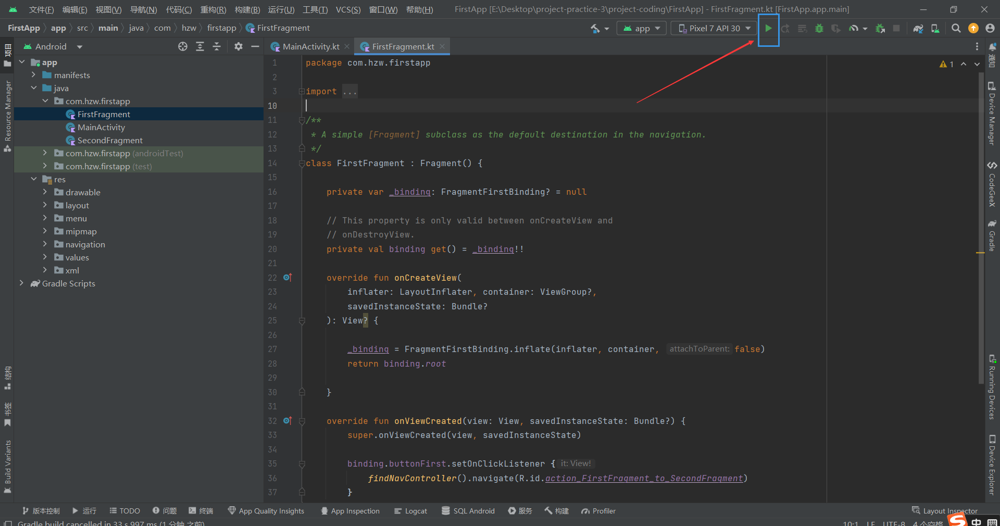

运行效果：

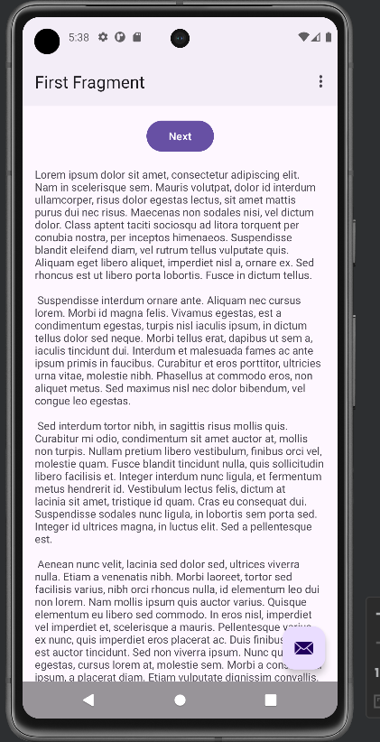

## 2.调整首页的布局及样式

### （1）调整页面布局

在res的values目录下的strings.xml文件中添加如下代码，定义textview及button中要显示的内容：

```xml
<string name="content_text">0</string>
<string name="toast_button_text">Toast</string>
<string name="count_button_text">Count</string>
<string name="random_button_text">Random</string>
```

修改fragment_first.xml文件代码，使用约束布局，其中含有一个TextView控件和三个Button控件。将控件的text属性设置为strings.xml中对应的资源。然后调整控件之间的约束关系，（以下描述可能有点抽象，可结合代码理解）让TextView控件的上下左右分别约束到屏幕的上下左右；将TOAST按钮的上下分别约束到COUNT按钮的上下（使得TOAST按钮和COUNT按钮在同一水平线上），左约束到屏幕的左边，右约束到COUNT按钮的左边；COUNT按钮的左约束到TOAST按钮的右边，右约束到RANDOM按钮的左边，上约束到TextView的底部，下约束到屏幕的底部；RANDOM按钮的上下分别约束到COUNT按钮的上下（使得RANDOM按钮和COUNT按钮在同一水平线上），左约束到COUNT按钮的右边，右约束到屏幕的右边。

```xml
<?xml version="1.0" encoding="utf-8"?>
<androidx.constraintlayout.widget.ConstraintLayout xmlns:tools="http://schemas.android.com/tools"
    android:layout_width="match_parent"
    android:layout_height="match_parent"
    xmlns:android="http://schemas.android.com/apk/res/android"
    xmlns:app="http://schemas.android.com/apk/res-auto">

    <TextView
        android:id="@+id/textview_first"
        android:layout_width="wrap_content"
        android:layout_height="wrap_content"
        android:text="@string/content_text"
        android:textColor="@android:color/darker_gray"
        android:textSize="60sp"
        android:textStyle="bold"
        app:layout_constraintBottom_toBottomOf="parent"
        app:layout_constraintEnd_toEndOf="parent"
        app:layout_constraintStart_toStartOf="parent"
        app:layout_constraintTop_toTopOf="parent" />

    <Button
        android:id="@+id/count_button"
        android:layout_width="wrap_content"
        android:layout_height="wrap_content"
        android:text="@string/count_button_text"
        app:layout_constraintBottom_toBottomOf="parent"
        app:layout_constraintEnd_toStartOf="@+id/random_button"
        app:layout_constraintHorizontal_bias="0.57"
        app:layout_constraintStart_toEndOf="@+id/toast_button"
        app:layout_constraintTop_toBottomOf="@+id/textview_first"
        app:layout_constraintVertical_bias="0.501" />

    <Button
        android:id="@+id/toast_button"
        android:layout_width="wrap_content"
        android:layout_height="wrap_content"
        android:layout_marginStart="4dp"
        android:text="@string/toast_button_text"
        app:layout_constraintBottom_toBottomOf="@+id/count_button"
        app:layout_constraintStart_toStartOf="parent"
        app:layout_constraintTop_toTopOf="@+id/count_button" />

    <Button
        android:id="@+id/random_button"
        android:layout_width="wrap_content"
        android:layout_height="wrap_content"
        android:layout_marginEnd="4dp"
        android:text="@string/random_button_text"
        app:layout_constraintBottom_toBottomOf="@+id/count_button"
        app:layout_constraintEnd_toEndOf="parent"
        app:layout_constraintTop_toTopOf="@+id/count_button" />

</androidx.constraintlayout.widget.ConstraintLayout>
```

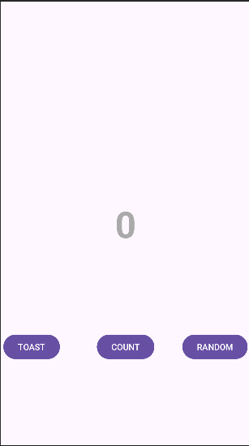

### （2）调整页面样式

在res>values>colors.xml文件中添加颜色值：

```xml
<color name="screenBackground">#2196F3</color>
<color name="buttonBackground">#BBDEFB</color>
```

在fragment_first.xml中给最外层的ConstraintLayout添加属性，设置背景颜色：

```xml
android:background="@color/screenBackground"
```

为每个按钮控件添加属性，设置背景颜色：

```xml
android:background="@color/buttonBackground"
```

设置TextView的文本颜色为color/white，设置字体大小为72sp：

```xml
android:textColor="@android:color/white"
android:textSize="72sp"
```

在属性面板的Constraint Widget中设置Toast与屏幕的左边距设置为24dp，Random与屏幕的右边距设置为24dp。

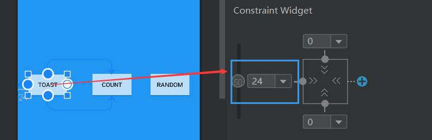

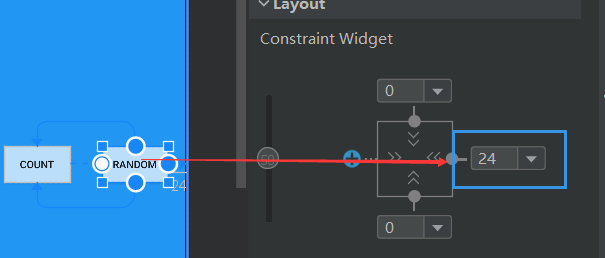

设置TextView的垂直偏移为0.3：

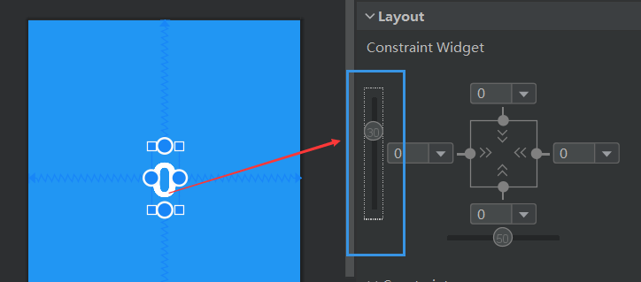

最终fragment_first.xml代码：

```xml
<?xml version="1.0" encoding="utf-8"?>
<androidx.constraintlayout.widget.ConstraintLayout xmlns:tools="http://schemas.android.com/tools"
    android:layout_width="match_parent"
    android:layout_height="match_parent"
    xmlns:android="http://schemas.android.com/apk/res/android"
    xmlns:app="http://schemas.android.com/apk/res-auto"
    android:background="@color/screenBackground">

    <TextView
        android:id="@+id/textview_first"
        android:layout_width="wrap_content"
        android:layout_height="wrap_content"
        android:text="@string/content_text"
        android:textColor="@android:color/white"
        android:textSize="72sp"
        android:textStyle="bold"
        app:layout_constraintBottom_toBottomOf="parent"
        app:layout_constraintEnd_toEndOf="parent"
        app:layout_constraintStart_toStartOf="parent"
        app:layout_constraintTop_toTopOf="parent"
        app:layout_constraintVertical_bias="0.3" />

    <Button
        android:id="@+id/count_button"
        android:layout_width="wrap_content"
        android:layout_height="wrap_content"
        android:text="@string/count_button_text"
        app:layout_constraintBottom_toBottomOf="parent"
        app:layout_constraintEnd_toStartOf="@+id/random_button"
        app:layout_constraintHorizontal_bias="0.57"
        app:layout_constraintStart_toEndOf="@+id/toast_button"
        app:layout_constraintTop_toBottomOf="@+id/textview_first"
        app:layout_constraintVertical_bias="0.501"
        android:background="@color/buttonBackground" />

    <Button
        android:id="@+id/toast_button"
        android:layout_width="wrap_content"
        android:layout_height="wrap_content"
        android:layout_marginStart="24dp"
        android:background="@color/buttonBackground"
        android:text="@string/toast_button_text"
        app:layout_constraintBottom_toBottomOf="@+id/count_button"
        app:layout_constraintStart_toStartOf="parent"
        app:layout_constraintTop_toTopOf="@+id/count_button" />

    <Button
        android:id="@+id/random_button"
        android:layout_width="wrap_content"
        android:layout_height="wrap_content"
        android:layout_marginEnd="24dp"
        android:background="@color/buttonBackground"
        android:text="@string/random_button_text"
        app:layout_constraintBottom_toBottomOf="@+id/count_button"
        app:layout_constraintEnd_toEndOf="parent"
        app:layout_constraintTop_toTopOf="@+id/count_button" />

</androidx.constraintlayout.widget.ConstraintLayout>
```

最终运行效果：

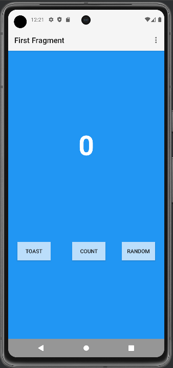

## 3.完成TOAST和COUNT功能

在FirstFragment.kt的onViewCreated方法中使用绑定机制添加TOAST按钮的点击事件：

```kotlin
// 给TOAST按钮添加点击监听事件
binding.toastButton.setOnClickListener {
    val myToast = Toast.makeText(context, "Hello Toast!", Toast.LENGTH_LONG)
    // 显示Toast
    myToast.show()
}
```

同理，给COUNT按钮添加点击事件：

```
// 给COUNT按钮添加点击事件
binding.countButton.setOnClickListener {
    countMe(view);
}
```

其中调用了自定义的countMe(view)函数：

```kotlin
// 计数函数
private fun countMe(view: View) {
    // 获取TextView中的内容
    val countString = binding.textviewFirst.text.toString()
    // 将字符串转为int型数值
    var count = countString.toInt()
    // 计数+1
    count++
    // 将新的数值展示在TextView上
    binding.textviewFirst.text = count.toString()
}
```

点击TOAST按钮的运行效果：

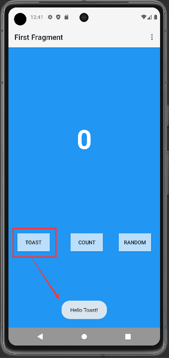

点击COUNT按钮的运行效果：

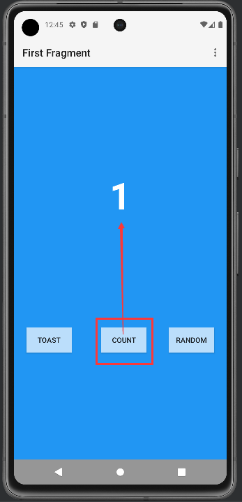

## 4.完成RANDOM功能

### （1）调整第二个页面的样式

在strings.xml中添加代码：

```xml
<string name="random_heading">Here is a random number between 0 and %d.</string>
<string name="textview_random">R</string>
```

在colors.xml中添加代码：

```xml
<color name="colorPrimaryDark">#3700B3</color>
<color name="screenBackground2">#26C6DA</color>
```

在fragment_second.xml中使用约束布局，其中有两个TextView控件和一个Button控件。其中一个TextView的id为textview_header，位于屏幕顶部，显示random_heading字符串资源的内容；另一个TextView的id为textview_random，用于展示随机数textview_random的值。Botton控件的id为button_second，用于跳转到上一个页面。

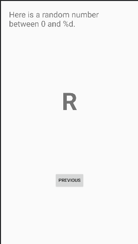

#### ①对于textview_header

使其顶部和左右两侧分别约束到屏幕的顶部和左右两侧，设置top，left和right的margin为24dp，左边距和右边距也就是start和end边距。并将TextView颜色设置为@color/colorPrimaryDark，字体大小为24sp。

```xml
<TextView
    android:id="@+id/textview_header"
    android:layout_width="match_parent"
    android:layout_height="wrap_content"
    android:layout_marginStart="24dp"
    android:layout_marginTop="24dp"
    android:layout_marginEnd="24dp"
    android:text="@string/random_heading"
    android:textSize="24sp"
    android:textColor="@color/colorPrimaryDark"
    app:layout_constraintEnd_toEndOf="parent"
    app:layout_constraintHorizontal_bias="0.0"
    app:layout_constraintStart_toStartOf="parent"
    app:layout_constraintTop_toTopOf="parent" />
```

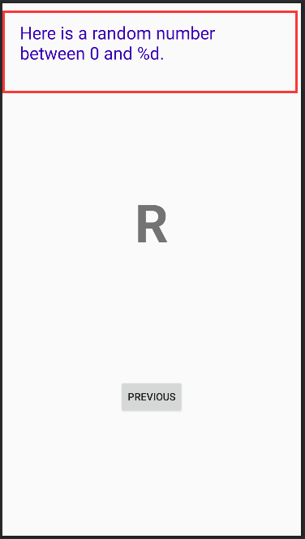

#### ②对于textview_random

使其左右约束至屏幕的左右侧，顶部约束至textview_header的底部，底部约束至Button的顶部。设置TextView的字体颜色textColor属性为@android:color/white，textSize为72sp，textStyle为bold。设置垂直偏移量layout_constraintVertical_bias为0.45。

```xml
<TextView
    android:id="@+id/textview_random"
    android:layout_width="wrap_content"
    android:layout_height="wrap_content"
    android:text="@string/textview_random"
    android:textColor="@color/white"
    android:textSize="72sp"
    android:textStyle="bold"
    app:layout_constraintBottom_toTopOf="@+id/button_second"
    app:layout_constraintEnd_toEndOf="parent"
    app:layout_constraintStart_toStartOf="parent"
    app:layout_constraintTop_toBottomOf="@+id/textview_header"
    app:layout_constraintVertical_bias="0.45" />
```

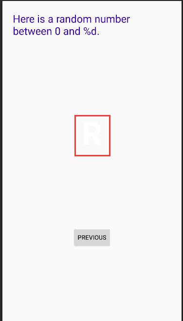

#### ③对于button_second

使其左右两侧及底部分别约束到屏幕的左右两侧及底部，顶部约束到textview_random的底部。

```xml
<Button
    android:id="@+id/button_second"
    android:layout_width="wrap_content"
    android:layout_height="wrap_content"
    android:text="@string/previous"
    app:layout_constraintBottom_toBottomOf="parent"
    app:layout_constraintEnd_toEndOf="parent"
    app:layout_constraintStart_toStartOf="parent"
    app:layout_constraintTop_toBottomOf="@id/textview_random"/>
```

#### ④修改背景颜色，样式调整完成

在ConstraintLayout中添加background属性，指定颜色：

```xml
android:background="@color/screenBackground2"
```

最终代码：

```xml
<?xml version="1.0" encoding="utf-8"?>
<androidx.constraintlayout.widget.ConstraintLayout xmlns:tools="http://schemas.android.com/tools"
    android:layout_width="match_parent"
    android:layout_height="match_parent"
    xmlns:android="http://schemas.android.com/apk/res/android"
    xmlns:app="http://schemas.android.com/apk/res-auto"
    android:background="@color/screenBackground2"
    >

    <TextView
        android:id="@+id/textview_header"
        android:layout_width="match_parent"
        android:layout_height="wrap_content"
        android:layout_marginStart="24dp"
        android:layout_marginTop="24dp"
        android:layout_marginEnd="24dp"
        android:text="@string/random_heading"
        android:textSize="24sp"
        android:textColor="@color/colorPrimaryDark"
        app:layout_constraintEnd_toEndOf="parent"
        app:layout_constraintHorizontal_bias="0.0"
        app:layout_constraintStart_toStartOf="parent"
        app:layout_constraintTop_toTopOf="parent" />

    <TextView
        android:id="@+id/textview_random"
        android:layout_width="wrap_content"
        android:layout_height="wrap_content"
        android:text="@string/textview_random"
        android:textColor="@color/white"
        android:textSize="72sp"
        android:textStyle="bold"
        app:layout_constraintBottom_toTopOf="@+id/button_second"
        app:layout_constraintEnd_toEndOf="parent"
        app:layout_constraintStart_toStartOf="parent"
        app:layout_constraintTop_toBottomOf="@+id/textview_header"
        app:layout_constraintVertical_bias="0.45" />

    <Button
        android:id="@+id/button_second"
        android:layout_width="wrap_content"
        android:layout_height="wrap_content"
        android:text="@string/previous"
        app:layout_constraintBottom_toBottomOf="parent"
        app:layout_constraintEnd_toEndOf="parent"
        app:layout_constraintStart_toStartOf="parent"
        app:layout_constraintTop_toBottomOf="@id/textview_random"/>

</androidx.constraintlayout.widget.ConstraintLayout>
```

最终样式：

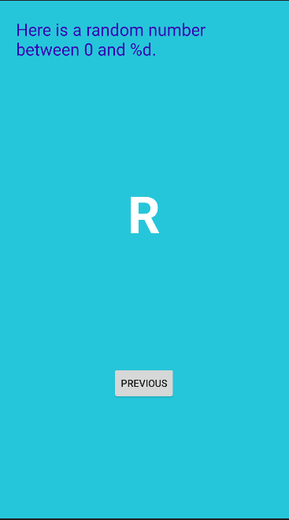

运行效果：

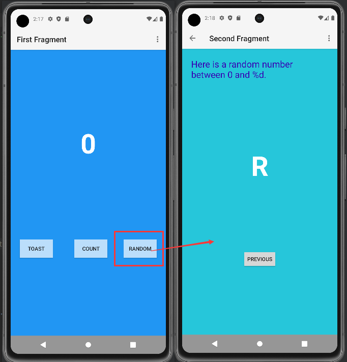

### （2）实现页面跳转时传参

#### ①启用SafeArgs

在项目级build.gradle的头部添加代码：

```groovy
buildscript {
    repositories {
        google()
    }
    dependencies {
        def nav_version = "2.7.7"
        classpath "androidx.navigation:navigation-safe-args-gradle-plugin:$nav_version"
    }
}
```

点击Sync now进行同步

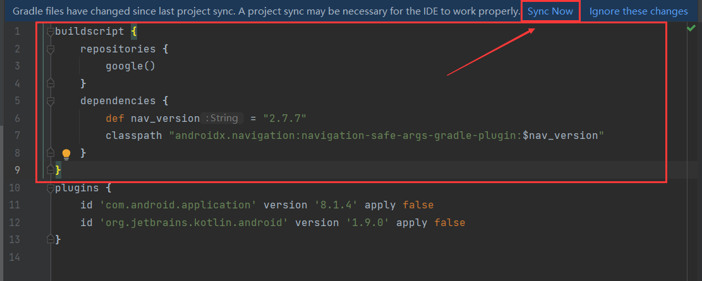

在模块级build.gradle中添加创建：

```groovy
id 'androidx.navigation.safeargs'
```

点击Sync now进行同步

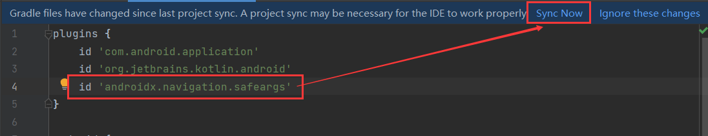

#### ②创建导航动作的参数

打开nav_graph导航视图，点击FirstFragment，在Actions栏中可以看到导航至SecondFragment。

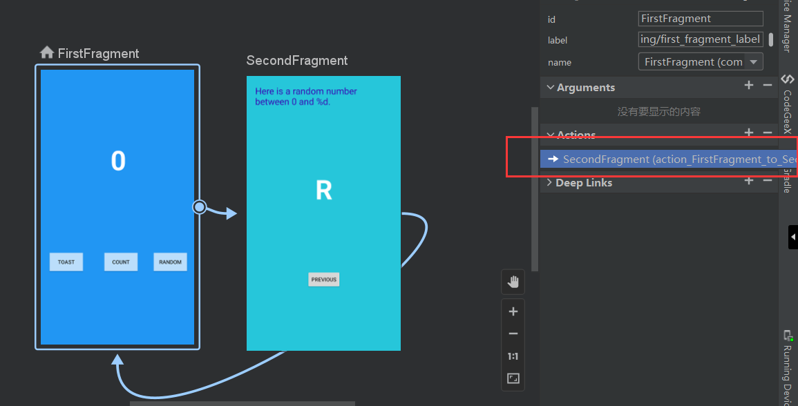

同理，查看SecondFragment的属性栏，点击Arguments "+"符号，在弹出的对话框中添加参数myArg，类型为整型Integer

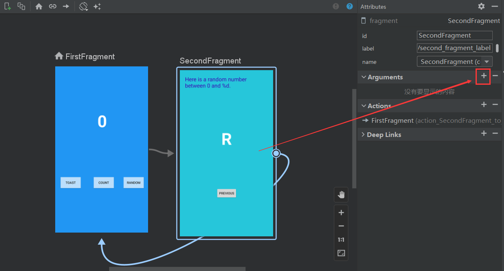

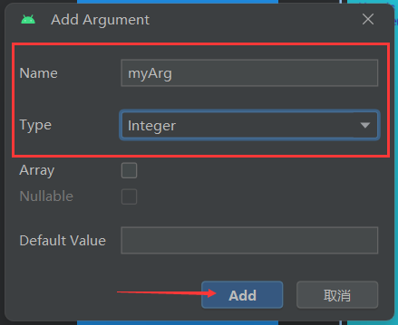

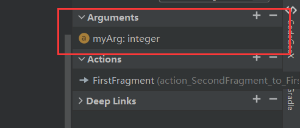

#### ③修改FirstFragment代码，向SecondFragment发数据

在FirstFragment.kt的onViewCreated()方法中添加RANDOM按钮的点击事件监听，在其中获取textview_first的值，将该值作为参数传递给actionFirstFragmentToSecondFragment()，然后添加导航事件代码：

```kotlin
// 给RANDOM按钮添加点击监听事件，跳转到第二个界面
binding.randomButton.setOnClickListener {
    // 获取textview_first的值
    val currentCount = binding.textviewFirst.text.toString().toInt()
    // 将该值作为参数传递给actionFirstFragmentToSecondFragment()
    val action = FirstFragmentDirections.actionFirstFragmentToSecondFragment(currentCount)
    // 根据action跳转
    findNavController().navigate(action)
}
```

#### ④ 修改SecondFragment代码，实现随机数显示

导入navArgs包

```kotlin
import androidx.navigation.fragment.navArgs
```

onViewCreated()代码之前添加一行

```kotlin
val args: SecondFragmentArgs by navArgs()
```

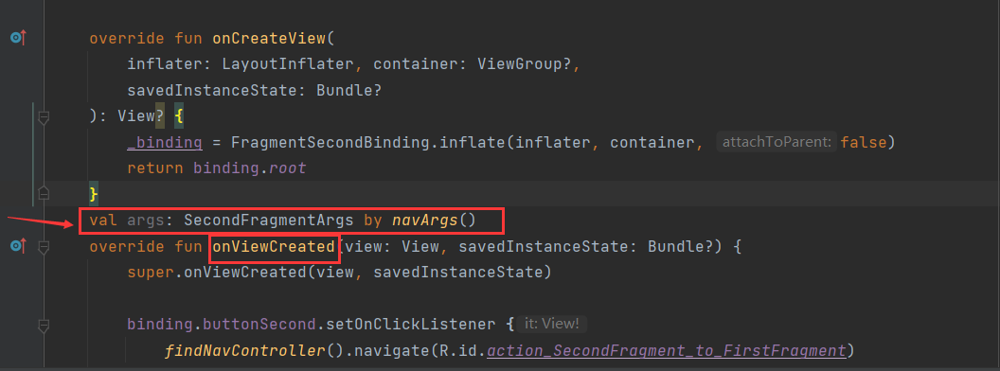

在onViewCreated()中获取传递过来的参数列表，提取count数值，并在textview_header中显示。随后生成随机数，在textview_random中显示该随机数。这一步骤的具体代码如下：

```kotlin
val args: SecondFragmentArgs by navArgs()
override fun onViewCreated(view: View, savedInstanceState: Bundle?) {
    super.onViewCreated(view, savedInstanceState)
    // 获取参数
    val count = args.myArg
    // 设置文本
    val countText = getString(R.string.random_heading, count)
    // 展示文本
    binding.textviewHeader.text = countText
    // 生成随机数
    val random = java.util.Random()
    var randomNumber = 0
    if (count > 0) {
        randomNumber = random.nextInt(count + 1)
    }
    // 在textview_random中显示该随机数
    binding.textviewRandom.text = randomNumber.toString()
    // 给返回按钮设置点击事件监听
    binding.buttonSecond.setOnClickListener {
        findNavController().navigate(R.id.action_SecondFragment_to_FirstFragment)
    }
}
```

## 5.完成所有功能，运行查看结果

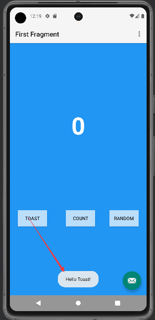

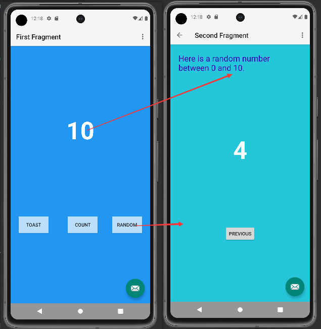


