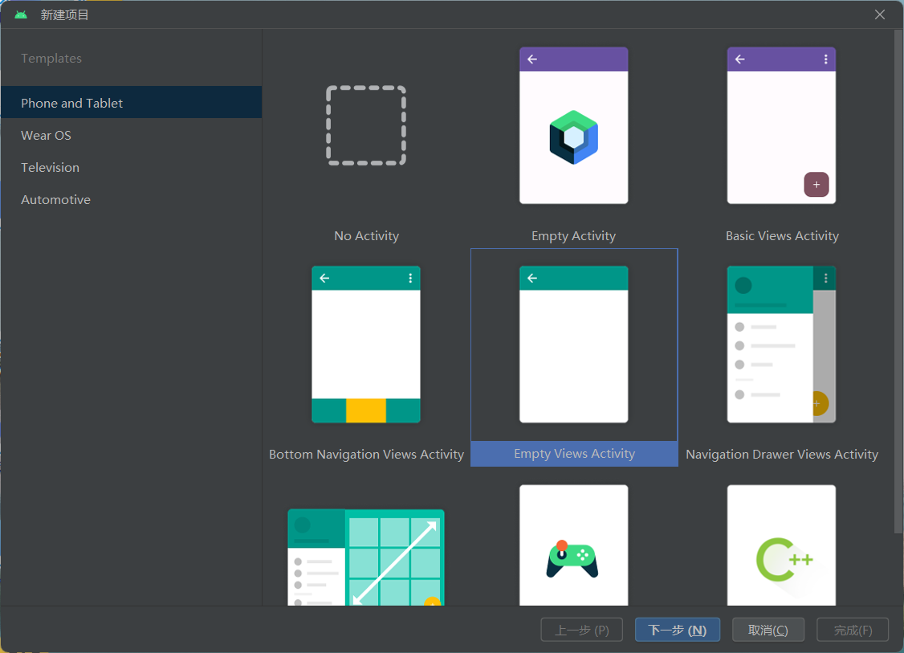

# **构建CameraX应用**

本次实验是构建CameraX应用，实现相机预览、拍照、图像分析以及录像功能。

## 1、新建并初始化项目

打开Android Studio，点击新建项目，选择Empty Views Activity



项目名称设置为“CameraXApp”，设置好基本信息后点击“完成”


在build.gradle（Module :app）中添加camerax的相关依赖

```groovy
dependencies {
    ……
    def camerax_version = "1.4.0-alpha05"
    implementation "androidx.camera:camera-core:${camerax_version}"
    implementation "androidx.camera:camera-camera2:${camerax_version}"
    implementation "androidx.camera:camera-lifecycle:${camerax_version}"
    implementation "androidx.camera:camera-video:${camerax_version}"
    implementation "androidx.camera:camera-view:${camerax_version}"
    implementation "androidx.camera:camera-extensions:${camerax_version}"
}
```

同时在android{}末尾添加代码，开启viewBinding

```groovy
android {
    ……
    buildFeatures {
        viewBinding true
    }
}
```

然后点击Sync Now进行同步


## 2、界面设计

修改activity_main.xml代码，其中有4个控件：

- 用于预览相机图片/视频的CameraX PreviewView
- 用于控制图片拍摄的标准按钮。
- 用于开始/停止视频拍摄的标准按钮。
- 用于放置 2 个按钮的垂直指南。

```xml
<?xml version="1.0" encoding="utf-8"?>
<androidx.constraintlayout.widget.ConstraintLayout
    xmlns:android="http://schemas.android.com/apk/res/android"
    xmlns:app="http://schemas.android.com/apk/res-auto"
    xmlns:tools="http://schemas.android.com/tools"
    android:layout_width="match_parent"
    android:layout_height="match_parent"
    tools:context=".MainActivity">

    <androidx.camera.view.PreviewView
        android:id="@+id/viewFinder"
        android:layout_width="match_parent"
        android:layout_height="match_parent"
        tools:ignore="MissingClass" />

    <Button
        android:id="@+id/image_capture_button"
        android:layout_width="110dp"
        android:layout_height="110dp"
        android:layout_marginBottom="50dp"
        android:layout_marginEnd="50dp"
        android:elevation="2dp"
        android:text="@string/take_photo"
        app:layout_constraintBottom_toBottomOf="parent"
        app:layout_constraintLeft_toLeftOf="parent"
        app:layout_constraintEnd_toStartOf="@id/vertical_centerline" />

    <Button
        android:id="@+id/video_capture_button"
        android:layout_width="110dp"
        android:layout_height="110dp"
        android:layout_marginBottom="50dp"
        android:layout_marginStart="50dp"
        android:elevation="2dp"
        android:text="@string/start_capture"
        app:layout_constraintBottom_toBottomOf="parent"
        app:layout_constraintStart_toEndOf="@id/vertical_centerline" />

    <androidx.constraintlayout.widget.Guideline
        android:id="@+id/vertical_centerline"
        android:layout_width="wrap_content"
        android:layout_height="wrap_content"
        android:orientation="vertical"
        app:layout_constraintGuide_percent=".50" />

</androidx.constraintlayout.widget.ConstraintLayout>
```

修改strings.xml代码

```xml
<resources>
    <string name="app_name">CameraXApp</string>
    <string name="take_photo">Take Photo</string>
    <string name="start_capture">Start Capture</string>
    <string name="stop_capture">Stop Capture</string>
</resources>
```

界面效果：


## 3、功能实现

### （1）初始化MainActivity.kt代码

```kotlin
package com.hzw.cameraxapp

import android.os.Bundle
import androidx.appcompat.app.AppCompatActivity
import com.hzw.cameraxapp.databinding.ActivityMainBinding

class MainActivity : AppCompatActivity() {
    // 声明一个ViewBinding类型的变量，使用lateinit关键字标记该属性将在之后初始化，而不是现在
    private lateinit var viewBinding: ActivityMainBinding
    // 重写onCreate方法，当Activity被创建时会被调用
    override fun onCreate(savedInstanceState: Bundle?) {
        super.onCreate(savedInstanceState)
        // 获取并使用viewBinding初始化布局
        viewBinding = ActivityMainBinding.inflate(layoutInflater)
        setContentView(viewBinding.root)
    }
}
```

### （2）添加申请权限部分代码

修改AndroidManifest.xml，在application标记之前添加如下代码声明需要获取的权限。添加android.hardware.camera.any可确保设备配有相机。指定.any表示它可以是前置摄像头，也可以是后置摄像头。

```xml
<!-- 声明在app中需要使用到相机 -->
<uses-feature android:name="android.hardware.camera.any" />
<!-- 需要相机权限 -->
<uses-permission android:name="android.permission.CAMERA" />
<!-- 需要录音权限 -->
<uses-permission android:name="android.permission.RECORD_AUDIO" />
<!-- 需要写外部存储权限 -->
<uses-permission android:name="android.permission.WRITE_EXTERNAL_STORAGE" android:maxSdkVersion="28" />
```

在MainActivity的onCreate(){}方法体后面定义检查是否有必要权限的方法

```kotlin
// 检查是否有必要权限的方法，all函数会遍历REQUIRED_PERMISSIONS集合中的每一项执行检查
private fun allPermissionsGranted() = REQUIRED_PERMISSIONS.all {
    ContextCompat.checkSelfPermission(baseContext, it) == PackageManager.PERMISSION_GRANTED
}
```

在后面定义一个伴生对象，用来存储一些与该类相关的常量和配置信息

```kotlin
// 定义伴生对象，用来存储一些与该类相关的常量和配置信息
companion object {
    private const val TAG = "CameraXApp"
    private const val FILENAME_FORMAT = "yyyy-MM-dd-HH-mm-ss-SSS"
    // 请求权限的请求码
    private const val REQUEST_CODE_PERMISSIONS = 10
    // 需要的权限列表
    private val REQUIRED_PERMISSIONS =
        mutableListOf (  // 创建可变列表存储需要的权限
            Manifest.permission.CAMERA,
            Manifest.permission.RECORD_AUDIO
        ).apply {  // 使用apply函数来初始化或修改MutableList
            // 如果设备运行在Android 9.0或更低版本，还需要WRITE_EXTERNAL_STORAGE写外部存储权限
            if (Build.VERSION.SDK_INT <= Build.VERSION_CODES.P) {
                add(Manifest.permission.WRITE_EXTERNAL_STORAGE)
            }
        }.toTypedArray()
}
```

在onCreate()方法中添加检查权限代码，如果已获得权限则开启相机，未获得权限则进行申请权限。在后面定义开启相机的方法。

```kotlin
override fun onCreate(savedInstanceState: Bundle?) {
    ……
    // 检查用户是否同意权限请求，同意继续执行相机相关操作
    if (allPermissionsGranted()) {
        startCamera()
    } else {
        // 否则执行请求获取必要的权限
        ActivityCompat.requestPermissions(this, REQUIRED_PERMISSIONS, REQUEST_CODE_PERMISSIONS)
    }
}
// 开启相机的方法
private fun startCamera() {}
```

重写onRequestPermissionsResult回调方法（可添在onCreate方法后），用于处理请求结果

```kotlin
// 重写onRequestPermissionsResult回调方法，处理请求结果
override fun onRequestPermissionsResult(requestCode: Int,
          permissions: Array<String>, grantResults: IntArray) {
    super.onRequestPermissionsResult(requestCode, permissions, grantResults)
    if (requestCode == REQUEST_CODE_PERMISSIONS) {  // 校验请求码
        if (allPermissionsGranted()) {
            // 用户同意权限请求，可以继续执行相机相关操作
            startCamera()
        } else {
            // 用户拒绝了权限请求，则提示用户
            Toast.makeText(this, "用户拒绝了权限请求", Toast.LENGTH_SHORT).show()
            finish()
        }
    }
}
```

运行应用，可以看到进入应用时会弹出弹出请求相关权限


### （3）实现Preview用例（相机预览）

在MainActivity中实现开启相机的方法startCamera()，具体步骤在代码注释中体现

``` kotlin
// 开启相机的方法
private fun startCamera() {
    // cameraProviderFuture用于将相机的生命周期绑定到生命周期所有者，消除打开和关闭相机的任务
    val cameraProviderFuture = ProcessCameraProvider.getInstance(this)
    // 给cameraProviderFuture添加监听
    cameraProviderFuture.addListener({
        // cameraProvider用于将相机的生命周期绑定到应用进程中的LifecycleOwner
        val cameraProvider: ProcessCameraProvider = cameraProviderFuture.get()
        // 使用Preview对象构造器构建Preview对象
        val preview = Preview.Builder().build()
            .also {// 扩展函数，设置渲染相机预览画面
                it.setSurfaceProvider(viewBinding.viewFinder.surfaceProvider)
            }
        // 创建CameraSelector对象，选择DEFAULT_BACK_CAMERA，表示选择默认的后置摄像头
        val cameraSelector = CameraSelector.DEFAULT_BACK_CAMERA
        // 确保当前没有任何内容绑定到cameraProvider后再进行绑定
        try {
            // 在重新绑定之前取消绑定用例
            cameraProvider.unbindAll()
            cameraProvider.bindToLifecycle(this, cameraSelector, preview)
        } catch(exc: Exception) {
            Log.e(TAG, "用例绑定失败", exc)
        }
    }, ContextCompat.getMainExecutor(this))  // 第二个参数返回一个在主线程上运行的Executor
}
```

重写onDestroy()，在该activity被销毁时关闭相机。可写在onRequestPermissionsResult方法体后面

```kotlin
override fun onDestroy() {
    super.onDestroy()
    // 关闭相机
    cameraExecutor.shutdown()
}
```

运行查看效果，可以看到相机预览：


### （4）实现ImageCapture用例（拍照）

在MainActivity中（viewBinding声明后）声明图像捕获对象和线程执行器

``` kotlin
// 声明图像捕获对象，用于拍照功能
private var imageCapture: ImageCapture? = null
// 声明线程执行器，用于执行相机相关操作的后台任务，以避免阻塞UI线程。
private lateinit var cameraExecutor: ExecutorService
```

在startCamera()方法中preview的下面添加构建ImageCapture对象的代码

```kotlin
private fun startCamera() {
    ……
    val preview = Preview.Builder().build().……
    // 构建ImageCapture对象
    imageCapture = ImageCapture.Builder().build()
    ……
}
```

在startCamera()方法中try语句块里修改cameraProvider.bindToLifecycle()，加上imageCapture

```kotlin
try {
    // 在重新绑定之前取消绑定用例
    cameraProvider.unbindAll()
    // 绑定用例到cameraProvider
    cameraProvider.bindToLifecycle(
        this, cameraSelector, preview, imageCapture)
} catch(exc: Exception) {
    Log.e(TAG, "用例绑定失败", exc)
}
```

在onCreate()方法中给拍照按钮添加点击事件

```kotlin
override fun onCreate(savedInstanceState: Bundle?) {
    ……
    // 给拍照按钮设置点击事件
    viewBinding.imageCaptureButton.setOnClickListener {
        takePhoto()
    }
}
```

实现takePhoto()方法

```kotlin
private fun takePhoto() {
    // 获取对ImageCapture用例的引用
    val imageCapture = imageCapture ?: return
    // 使用时间戳创建用于保存图片的MediaStore内容值,确保显示名唯一
    val name = SimpleDateFormat(FILENAME_FORMAT, Locale.US).format(System.currentTimeMillis())
    val contentValues = ContentValues().apply {
        put(MediaStore.MediaColumns.DISPLAY_NAME, name)
        put(MediaStore.MediaColumns.MIME_TYPE, "image/jpeg")
        if(Build.VERSION.SDK_INT > Build.VERSION_CODES.P) {
            put(MediaStore.Images.Media.RELATIVE_PATH, "Pictures/CameraX-Image")
        }
    }
    // 创建OutputFileOptions对象,指定输出内容
    val outputOptions = ImageCapture.OutputFileOptions
        .Builder(contentResolver,
            MediaStore.Images.Media.EXTERNAL_CONTENT_URI,
            contentValues)
        .build()

    // 进行拍照
    imageCapture.takePicture(
        outputOptions,
        ContextCompat.getMainExecutor(this),
        object : ImageCapture.OnImageSavedCallback {
            // 失败
            override fun onError(exc: ImageCaptureException) {
                Log.e(TAG, "拍照失败: ${exc.message}", exc)
            }
            // 成功，则提示拍照成功，并显示图片路径
            override fun onImageSaved(output: ImageCapture.OutputFileResults){
                val msg = "拍照成功: ${output.savedUri}"
                Toast.makeText(baseContext, msg, Toast.LENGTH_SHORT).show()
                Log.d(TAG, msg)
            }
        }
    )
}
```

运行效果：


### （5）实现ImageAnalysis用例（图片分析）

*该功能需要Android 10及更高版本的设备，建议使用实体设备来测试这部分代码。*

定义实现ImageAnalysis.Analyzer接口的自定义类LuminosityAnalyzer，并使用传入的相机帧调用该类。将此分析器添加为MainActivity.kt中的内部类，实现该接口中的analyze()方法，记录图像的平均亮度。

``` kotlin
// 定义LuminosityAnalyzer类实现ImageAnalysis.Analyzer接口，用来分析图像
private class LuminosityAnalyzer(private val listener: LumaListener) : ImageAnalysis.Analyzer {
    // 重写分析方法
    override fun analyze(image: ImageProxy) {
        // 获取图像的像素数据
        val buffer = image.planes[0].buffer
        // 将像素数据转换为字节数组
        val data = buffer.toByteArray()
        // 将字节数组转换为灰度像素值
        val pixels = data.map { it.toInt() and 0xFF }
        // 计算灰度像素值的平均值
        val luma = pixels.average()
        // 回调给调用者
        listener(luma)
        // 释放ImageProxy
        image.close()
    }

    private fun ByteBuffer.toByteArray(): ByteArray {
        rewind()    // 将缓冲区的位置重置为0
        val data = ByteArray(remaining())
        get(data)   // 将缓冲区的数据复制到字节数组中
        return data // 返回字节数组
    }
}
```

更新startCamera()，将以下代码添加到imageCapture代码下方

```kotlin
val imageAnalyzer = ImageAnalysis.Builder()
    .build()
    .also {
        it.setAnalyzer(cameraExecutor, LuminosityAnalyzer { luma ->
            Log.d(TAG, "Average luminosity: $luma")
        })
    }
```

更新cameraProvider上的bindToLifecycle()调用，以包含imageAnalyzer

```kotlin
cameraProvider.bindToLifecycle(
   this, cameraSelector, preview, imageCapture, imageAnalyzer)
```

在真机上运行，查看Logcat中持续出现“Average luminosity: ...”记录图像平均亮度


### （6）实现VideoCapture用例（拍摄视频）

在MainActivity中声明视频捕获对象videoCapture以及recording对象

```kotlin
// 声明视频捕获对象，用于录制视频功能
private var videoCapture: VideoCapture<Recorder>? = null
// 声明一个Recording对象，用于表示当前录制的视频
private var recording: Recording? = null
```

创建captureVideo()方法，用于控制VideoCapture用例的启动和停止

```kotlin
// 录像的方法
private fun captureVideo() {
    // 检查是否已创建VideoCapture用例
    val videoCapture = this.videoCapture ?: return
    // 在CameraX完成请求操作之前，停用界面按钮
    viewBinding.videoCaptureButton.isEnabled = false
    // 如果有正在进行的录制操作，将其停止并释放当前的recording
    val curRecording = recording
    if (curRecording != null) {
        curRecording.stop()
        recording = null
        return
    }
    // 创建一个新的录像会话
    val name = SimpleDateFormat(FILENAME_FORMAT, Locale.US)
        .format(System.currentTimeMillis())
    val contentValues = ContentValues().apply {
        put(MediaStore.MediaColumns.DISPLAY_NAME, name)
        put(MediaStore.MediaColumns.MIME_TYPE, "video/mp4")
        if (Build.VERSION.SDK_INT > Build.VERSION_CODES.P) {
            put(MediaStore.Video.Media.RELATIVE_PATH, "Movies/CameraX-Video")
        }
    }
    // 外部内容选项创建MediaStoreOutputOptions.Builder,构建MediaStoreOutputOptions实例
    val mediaStoreOutputOptions = MediaStoreOutputOptions
        .Builder(contentResolver, MediaStore.Video.Media.EXTERNAL_CONTENT_URI)
        .setContentValues(contentValues)
        .build()
    // 将输出选项配置为VideoCapture的Recorder并启用录音
    recording = videoCapture.output
        .prepareRecording(this, mediaStoreOutputOptions)
        .apply {// 启用音频
            if (PermissionChecker.checkSelfPermission(this@MainActivity,
                    Manifest.permission.RECORD_AUDIO) ==
                PermissionChecker.PERMISSION_GRANTED)
            {
                withAudioEnabled()
            }
        }
        .start(ContextCompat.getMainExecutor(this)) { recordEvent ->
            when(recordEvent) {
                // 录像开始
                is VideoRecordEvent.Start -> {
                    // 修改按钮文本和启用状态
                    viewBinding.videoCaptureButton.apply {
                        text = getString(R.string.stop_capture)
                        isEnabled = true
                    }
                }
                // 录像结束
                is VideoRecordEvent.Finalize -> {
                    if (!recordEvent.hasError()) {
                        // 录像成功
                        val msg = "录像成功: " +
                                "${recordEvent.outputResults.outputUri}"
                        Toast.makeText(baseContext, msg, Toast.LENGTH_SHORT)
                            .show()
                        Log.d(TAG, msg)
                    } else {
                        // 录像出错，关闭录像并打印日志
                        recording?.close()
                        recording = null
                        Log.e(TAG, "Video capture ends with error: " +
                                "${recordEvent.error}")
                    }
                    // 恢复按钮状态
                    viewBinding.videoCaptureButton.apply {
                        text = getString(R.string.start_capture)
                        isEnabled = true
                    }
                }
            }
        }
}
```

在onCreate()方法中给录制按钮设置点击事件

```kotlin
override fun onCreate(savedInstanceState: Bundle?) {
    ……
    // 给录制按钮设置点击事件
    viewBinding.videoCaptureButton.setOnClickListener {
        captureVideo()
    }
}
```

在startCamera()中，将以下代码放置在imageAnalyzer创建行之后，创建 VideoCapture 用例

```kotlin
val recorder = Recorder.Builder()
   .setQualitySelector(QualitySelector.from(Quality.HIGHEST))
   .build()
videoCapture = VideoCapture.withOutput(recorder)
```

将try语句块中的cameraProvider.bindToLifecycle()调用替换为以下代码：

```kotlin
cameraProvider.bindToLifecycle(this, cameraSelector, preview, videoCapture)
```

运行，尝试录像，点击开始录像后该按钮显示“Stop Capture”，再次点击即可停止录像，录像成功并保存视频，可在相册或文件浏览器中找到该视频。


### （7）扩展实验（尝试多种组合）

实际上修改cameraProvider.bindToLifecycle中的参数即可。

如果需要Preview+VideoCapture+ImageCapture组合就是如下代码

```kotlin
cameraProvider.bindToLifecycle(this, cameraSelector, preview, videoCapture, imageCapture)
```

如图所示，运行后可在录像状态下拍照


如果需要Preview+VideoCapture+ImageAnalysis组合就是如下代码

```kotlin
cameraProvider.bindToLifecycle(this, cameraSelector, preview, videoCapture, imageAnalyzer)
```


如果需要Preview+VideoCapture+ImageCapture+ImageAnalysis组合就是如下代码

```kotlin
cameraProvider.bindToLifecycle(this, cameraSelector, preview, videoCapture, imageCapture, imageAnalyzer)
```


