# **Jupyter Notebook实践**


在本实验中需要掌握Notebook工具的基本原理，使用Python完成选择排序程序，并完成Python数据分析的例子。

## 一、Jupyter Notebook的基本操作

### 1 新建Notebook

#### 1.1 在Anaconda中启动Notebook创建


打开后就是这个界面

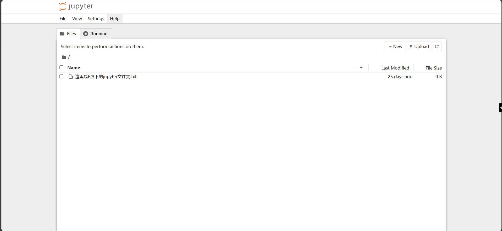

点击New->Notebook新建一个扩展名为ipynb的文件

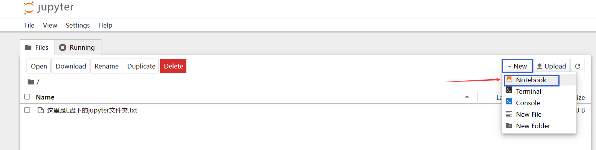

在Notebook页面选择Python3(ipykernel)内核

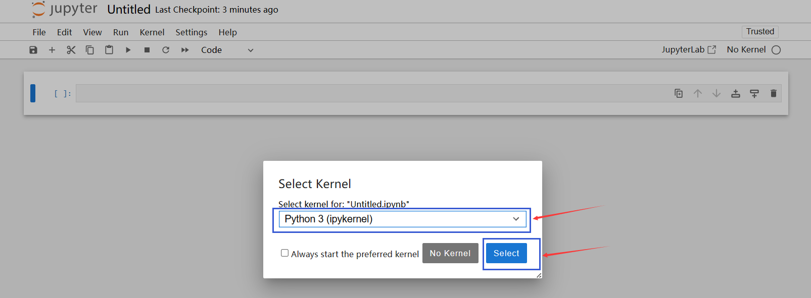

然后就可以在cell中愉快地敲代码咯

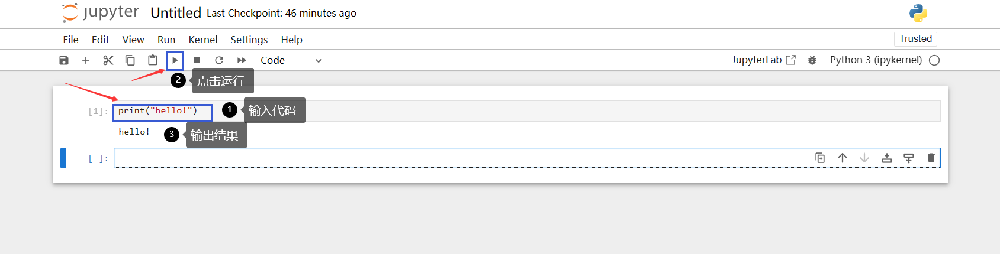


#### 1.2 在VS Code中创建

我们可以从Anaconda Navigator 中启动VS Code，也可以直接在外部启动VS Code


启动后点击“新建文件”，选择Jupyter Notebook

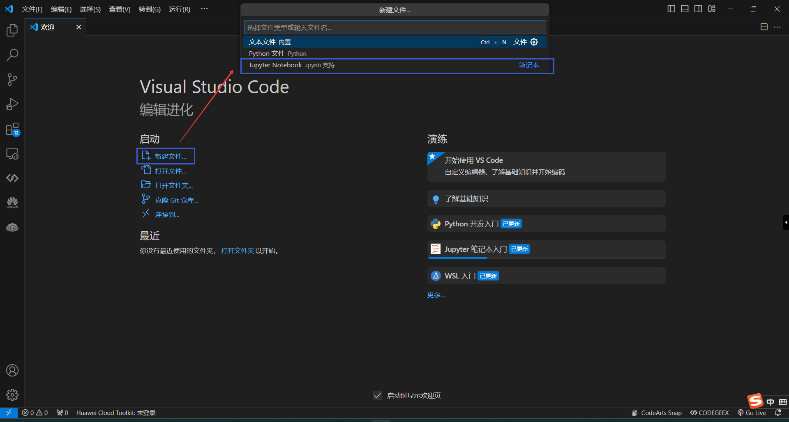

注意查看有没有选择内核，若没有则选择Python3内核

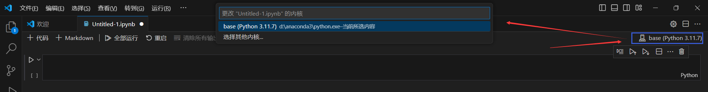

配置好这些后就能写代码啦

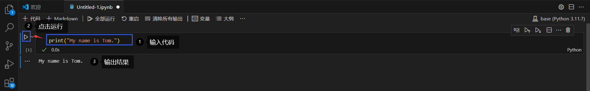

### 2 cell和kernal

#### 2.1 cell

主要包含两种类型的cell：

- Code cell：包含可被kernel执行的代码，执行之后在下方显示输出。

- Markdown cell：书写Markdown标记语言的cell。

下面我们尝试使用code cell来写一个简单的输出程序


```python
print("Hello, Notebook!")
```

    Hello, Notebook!


代码执行之后，cell左侧的标签从[ ]变成了[1]。[]中的数字代表kernel执行的顺序，而[*]则表示代码cell正在执行代码。

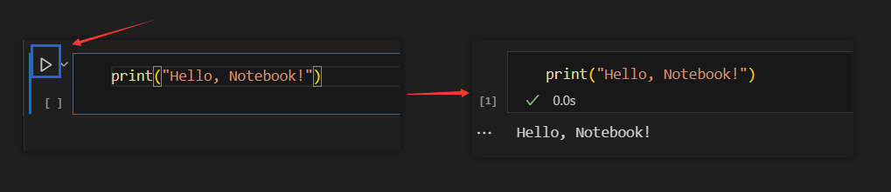

现在我们又创建了一个Markdown cell，用来写一些说明性的文字。


cell有两种模式，分别是编辑模式（edit mode）和命名模式（command mode）

- 编辑模式：按enter键切换，可在此模式下输入代码

- 命令模式：按esc键切换，可在此模式下输入要操作的命令

命令模式下的常用快捷键：

- 上下键头可以上下cell移动

- A或者B在上方或者下方插入一个cell

- M 将转换活动cell为Markdown cell

- Y 将设置活动cell为代码 cell

- D+D（两次）删除cell

- Z 撤销删除

- H 打开所有快捷键的说明

- 在编辑模式，Ctrl+Shift+-可将以光标处作为分割点，将cell一分为二。

#### 2.2 Kernel
每个notebook都基于一个内核运行，当执行cell代码时，代码将在内核当中运行，运行的结果会显示在页面上。Kernel中运行的状态在整个文档中是延续的，可以跨越所有的cell。在一个Notebook某个cell定义的函数或者变量等，在其他cell也可以使用。例如：


```python
import numpy as np
def square(x):
    return x * x
```

上述代码中导入了numpy并给它起了np的别名，还定义了square(x)方法。执行上述代码cell之后，后续的cell可以使用np和square


```python
x = np.random.randint(1, 10)
y = square(x)
print('%d squared is %d' % (x, y))
```

    5 squared is 25


## 二、简单python程序例子——选择排序算法

### 2.1 选择排序算法
选择排序是一种简单直观的排序算法，首先在未排序序列中找到最小元素（如果是从小到大排序则选最小，从大到小排序则选最大）存放到排序序列的起始位置，再从剩余未排序元素中继续寻找最小元素放到已排序序列的末尾。以此类推，直到所有元素均排序完毕。

### 2.2 选择排序算法实现


定义选择排序函数：


```python
def selection_sort(arr):
    for i in range(len(arr)):
        min_index = i
        for j in range(i+1, len(arr)):
            if arr[j] < arr[min_index]:
                min_index = j
        if min_index != i:
            arr[i], arr[min_index] = arr[min_index], arr[i]
```

定义test函数进行测试，执行数据输入，并调用selection_sort函数进行排序，最后输出结果。


```python
def test():
    arr = [2, 7, 12, 1, 3, 11, 6, 9]
    print("原始数组：", arr)
    selection_sort(arr)
    print("排序后的数组：", arr)


test()
```

    原始数组： [2, 7, 12, 1, 3, 11, 6, 9]
    排序后的数组： [1, 2, 3, 6, 7, 9, 11, 12]


## 三、进行数据分析

### 1 设置
导入相关的工具库


```python
%matplotlib inline
import pandas as pd
import matplotlib.pyplot as plt
import seaborn as sns
```

pandas用于数据处理，matplotlib用于绘图，seaborn使绘图更美观。第一行不是python命令，而被称为line magic。%表示作用与一行，%%表示作用于全文。此处%matplotlib inline 表示使用matlib画图，并将图片输出。


随后，加载数据集，注意要将文件路径修改为实际存放的路径。


```python
df = pd.read_csv('fortune500.csv')
```

### 2 检查数据集
上述代码执行生成的df对象，是pandas常用的数据结构，称为DataFrame，可以理解为数据表。

调用df.head(n)可以查看数据表的前n行,如果n未指定，则默认为5。


```python
df.head(3)
```

<div>
    <style scoped>
        .dataframe tbody tr th:only-of-type {
            vertical-align: middle;
        }
        .dataframe tbody tr th {
            vertical-align: top;
        }
        .dataframe thead th {
            text-align: right;
        }
    </style>
    <table border="1" class="dataframe">
      <thead>
        <tr style="text-align: right;">
          <th></th>
          <th>Year</th>
          <th>Rank</th>
          <th>Company</th>
          <th>Revenue (in millions)</th>
          <th>Profit (in millions)</th>
        </tr>
      </thead>
      <tbody>
        <tr>
          <th>0</th>
          <td>1955</td>
          <td>1</td>
          <td>General Motors</td>
          <td>9823.5</td>
          <td>806</td>
        </tr>
        <tr>
          <th>1</th>
          <td>1955</td>
          <td>2</td>
          <td>Exxon Mobil</td>
          <td>5661.4</td>
          <td>584.8</td>
        </tr>
        <tr>
          <th>2</th>
          <td>1955</td>
          <td>3</td>
          <td>U.S. Steel</td>
          <td>3250.4</td>
          <td>195.4</td>
        </tr>
      </tbody>
    </table>
</div>


```python
df.head()
```

<div>
<style scoped>
    .dataframe tbody tr th:only-of-type {
        vertical-align: middle;
    }
    .dataframe tbody tr th {
        vertical-align: top;
    }
    .dataframe thead th {
        text-align: right;
    }
</style>
    <table border="1" class="dataframe">
      <thead>
        <tr style="text-align: right;">
          <th></th>
          <th>Year</th>
          <th>Rank</th>
          <th>Company</th>
          <th>Revenue (in millions)</th>
          <th>Profit (in millions)</th>
        </tr>
      </thead>
      <tbody>
        <tr>
          <th>0</th>
          <td>1955</td>
          <td>1</td>
          <td>General Motors</td>
          <td>9823.5</td>
          <td>806</td>
        </tr>
        <tr>
          <th>1</th>
          <td>1955</td>
          <td>2</td>
          <td>Exxon Mobil</td>
          <td>5661.4</td>
          <td>584.8</td>
        </tr>
        <tr>
          <th>2</th>
          <td>1955</td>
          <td>3</td>
          <td>U.S. Steel</td>
          <td>3250.4</td>
          <td>195.4</td>
        </tr>
        <tr>
          <th>3</th>
          <td>1955</td>
          <td>4</td>
          <td>General Electric</td>
          <td>2959.1</td>
          <td>212.6</td>
        </tr>
        <tr>
          <th>4</th>
          <td>1955</td>
          <td>5</td>
          <td>Esmark</td>
          <td>2510.8</td>
          <td>19.1</td>
        </tr>
      </tbody>
    </table>
</div>

调用df.tail(n)可以查看数据表的后n行，如果n未指定，则默认为5。


```python
df.tail(4)
```

<div>
    <style scoped>
        .dataframe tbody tr th:only-of-type {
            vertical-align: middle;
        }
        .dataframe tbody tr th {
            vertical-align: top;
        }
        .dataframe thead th {
            text-align: right;
        }
    </style>
    <table border="1" class="dataframe">
      <thead>
        <tr style="text-align: right;">
          <th></th>
          <th>Year</th>
          <th>Rank</th>
          <th>Company</th>
          <th>Revenue (in millions)</th>
          <th>Profit (in millions)</th>
        </tr>
      </thead>
      <tbody>
        <tr>
          <th>25496</th>
          <td>2005</td>
          <td>497</td>
          <td>Peabody Energy</td>
          <td>3631.6</td>
          <td>175.4</td>
        </tr>
        <tr>
          <th>25497</th>
          <td>2005</td>
          <td>498</td>
          <td>Wendy's International</td>
          <td>3630.4</td>
          <td>57.8</td>
        </tr>
        <tr>
          <th>25498</th>
          <td>2005</td>
          <td>499</td>
          <td>Kindred Healthcare</td>
          <td>3616.6</td>
          <td>70.6</td>
        </tr>
        <tr>
          <th>25499</th>
          <td>2005</td>
          <td>500</td>
          <td>Cincinnati Financial</td>
          <td>3614.0</td>
          <td>584</td>
        </tr>
      </tbody>
    </table>
</div>


```python
df.tail()
```


<div>
    <style scoped>
        .dataframe tbody tr th:only-of-type {
            vertical-align: middle;
        }
        .dataframe tbody tr th {
            vertical-align: top;
        }

        .dataframe thead th {
            text-align: right;
        }
    </style>
    <table border="1" class="dataframe">
      <thead>
        <tr style="text-align: right;">
          <th></th>
          <th>Year</th>
          <th>Rank</th>
          <th>Company</th>
          <th>Revenue (in millions)</th>
          <th>Profit (in millions)</th>
        </tr>
      </thead>
      <tbody>
        <tr>
          <th>25495</th>
          <td>2005</td>
          <td>496</td>
          <td>Wm. Wrigley Jr.</td>
          <td>3648.6</td>
          <td>493</td>
        </tr>
        <tr>
          <th>25496</th>
          <td>2005</td>
          <td>497</td>
          <td>Peabody Energy</td>
          <td>3631.6</td>
          <td>175.4</td>
        </tr>
        <tr>
          <th>25497</th>
          <td>2005</td>
          <td>498</td>
          <td>Wendy's International</td>
          <td>3630.4</td>
          <td>57.8</td>
        </tr>
        <tr>
          <th>25498</th>
          <td>2005</td>
          <td>499</td>
          <td>Kindred Healthcare</td>
          <td>3616.6</td>
          <td>70.6</td>
        </tr>
        <tr>
          <th>25499</th>
          <td>2005</td>
          <td>500</td>
          <td>Cincinnati Financial</td>
          <td>3614.0</td>
          <td>584</td>
        </tr>
      </tbody>
    </table>
</div>
现在我们对数据属性列进行重命名，以便在后续访问。


```python
df.columns = ['year', 'rank', 'company', 'revenue', 'profit']
```

接下来，调用len()检查数据条目是否加载完整。从1955至2055年总共有25500条目录。


```python
len(df)
```


    25500

然后，我们调用df.dtypes检查属性列的类型。


```python
df.dtypes
```


    year         int64
    rank         int64
    company     object
    revenue    float64
    profit      object
    dtype: object

对于profit属性，我们期望的是float类型，因此其可能包含非数字的值，现在我们利用正则表达式进行检查并输出前5条数据。


```python
non_numberic_profits = df.profit.str.contains('[^0-9.-]')
df.loc[non_numberic_profits].head()
```

<div>
    <style scoped>
        .dataframe tbody tr th:only-of-type {
            vertical-align: middle;
        }
        .dataframe tbody tr th {
            vertical-align: top;
        }
        .dataframe thead th {
            text-align: right;
        }
    </style>
    <table border="1" class="dataframe">
      <thead>
        <tr style="text-align: right;">
          <th></th>
          <th>year</th>
          <th>rank</th>
          <th>company</th>
          <th>revenue</th>
          <th>profit</th>
        </tr>
      </thead>
      <tbody>
        <tr>
          <th>228</th>
          <td>1955</td>
          <td>229</td>
          <td>Norton</td>
          <td>135.0</td>
          <td>N.A.</td>
        </tr>
        <tr>
          <th>290</th>
          <td>1955</td>
          <td>291</td>
          <td>Schlitz Brewing</td>
          <td>100.0</td>
          <td>N.A.</td>
        </tr>
        <tr>
          <th>294</th>
          <td>1955</td>
          <td>295</td>
          <td>Pacific Vegetable Oil</td>
          <td>97.9</td>
          <td>N.A.</td>
        </tr>
        <tr>
          <th>296</th>
          <td>1955</td>
          <td>297</td>
          <td>Liebmann Breweries</td>
          <td>96.0</td>
          <td>N.A.</td>
        </tr>
        <tr>
          <th>352</th>
          <td>1955</td>
          <td>353</td>
          <td>Minneapolis-Moline</td>
          <td>77.4</td>
          <td>N.A.</td>
        </tr>
      </tbody>
    </table>
</div>

发现确实存在profit这一列为字符串的记录，利用len()统计一下总共存在多少条这样的记录。


```python
len(df.profit[non_numberic_profits])
```


    369

统计出总共有369条是profit列包含非数字的记录，我们可以使用直方图来直观展示按照年份的分布情况。


```python
bin_sizes, _, _ = plt.hist(df.year[non_numberic_profits], bins=range(1955, 2006))
```


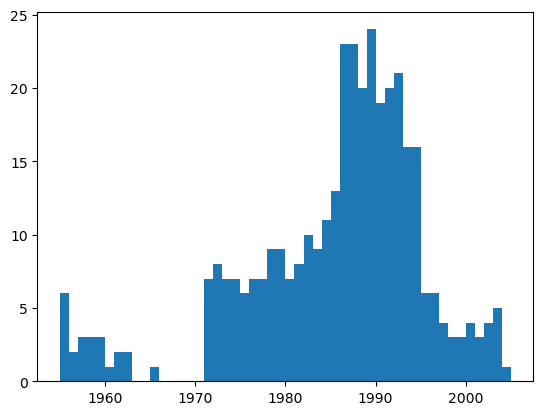
​    


可见，单独年份这样的记录数都少于25条，即少于4%的比例。这在可以接受的范围内，因此删除这些记录。


```python
df = df.loc[~non_numberic_profits]
df.profit = df.profit.apply(pd.to_numeric)
```

再次检查数据记录的条目数以及各属性列的类型。


```python
len(df)
```


    25131


```python
df.dtypes
```


    year         int64
    rank         int64
    company     object
    revenue    float64
    profit     float64
    dtype: object


profit的类型现在变为了float64，上述操作已经达到清洗无效数据记录的效果。

### 3 使用matplotlib进行绘图
接下来，以年分组绘制平均利润和收入。首先定义变量和方法。


```python
group_by_year = df.loc[:, ['year', 'revenue', 'profit']].groupby('year')
avgs = group_by_year.mean()
x = avgs.index
y1 = avgs.profit
def plot(x, y, ax, title, y_label):
    ax.set_title(title)
    ax.set_ylabel(y_label)
    ax.plot(x, y)
    ax.margins(x=0, y=0)
```

开始绘图。


```python
fig, ax = plt.subplots()
plot(x, y1, ax, 'Increase in mean Fortune 500 company profits from 1955 to 2005', 'Profit (millions)')
```


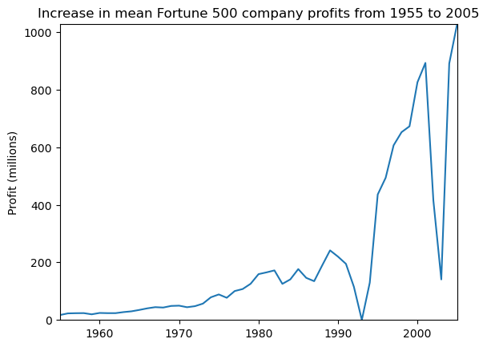
    


看起来像指数增长，但是1990年代初期出现急剧下滑，对应当时经济衰退和网络泡沫。再来看看收入曲线。


```python
y2 = avgs.revenue
fig, ax = plt.subplots()
plot(x, y2, ax, 'Increase in mean Fortune 500 company revenues from 1955 to 2005', 'Revenue (millions)')
```


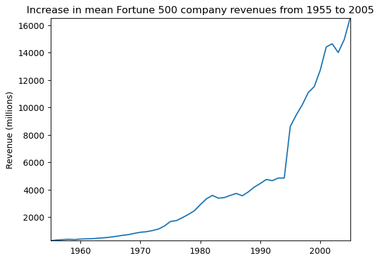
    


公司收入曲线并没有出现急剧下降，可能是由于财务会计的处理。对数据结果进行标准差处理。


```python
def plot_with_std(x, y, stds, ax, title, y_label):
    ax.fill_between(x, y - stds, y + stds, alpha=0.2)
    plot(x, y, ax, title, y_label)
fig, (ax1, ax2) = plt.subplots(ncols=2)
title = 'Increase in mean and std Fortune 500 company %s from 1955 to 2005'
stds1 = group_by_year.std().profit.values
stds2 = group_by_year.std().revenue.values
plot_with_std(x, y1.values, stds1, ax1, title % 'profits', 'Profit (millions)')
plot_with_std(x, y2.values, stds2, ax2, title % 'revenues', 'Revenue (millions)')
fig.set_size_inches(14, 4)
fig.tight_layout()
```


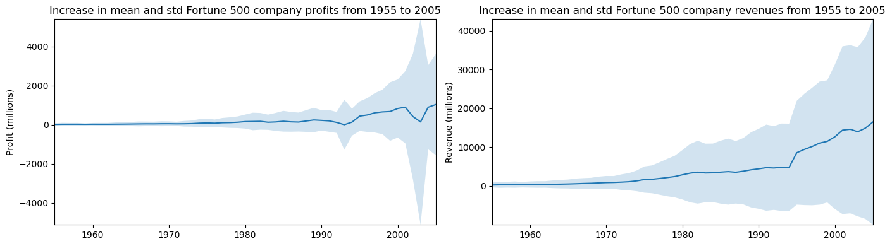
    


可见，不同公司之间的收入和利润差距惊人，那么到底前10%和后10%的公司谁的波动更大了？此外，还有很多有价值的信息值得进一步挖掘。
