# **实现基本的图像分类APP**

本次实验需要构建基于TensorFlow Lite的Android花卉识别应用。

## 获取并运行初始代码

打开github项目链接下载代码的ZIP包，并解压缩到工作目录。

```
https://github.com/hoitab/TFLClassify.git
```

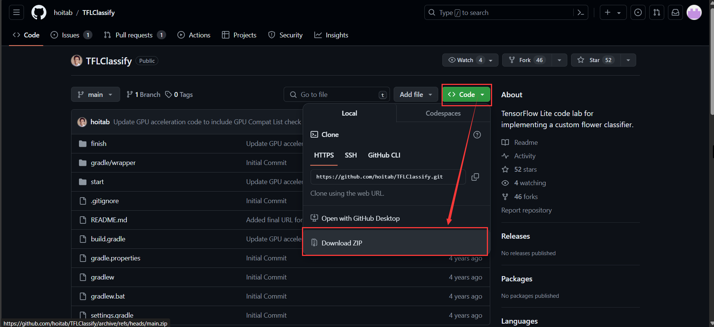

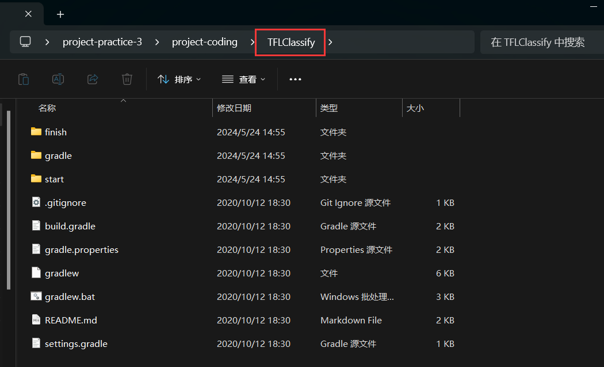

用Android Studio打开项目

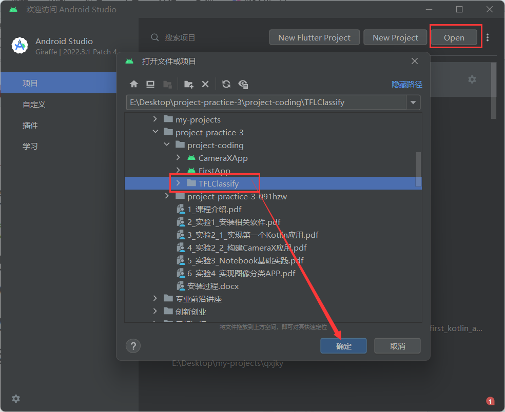

第一次编译需要先更新Gradle版本

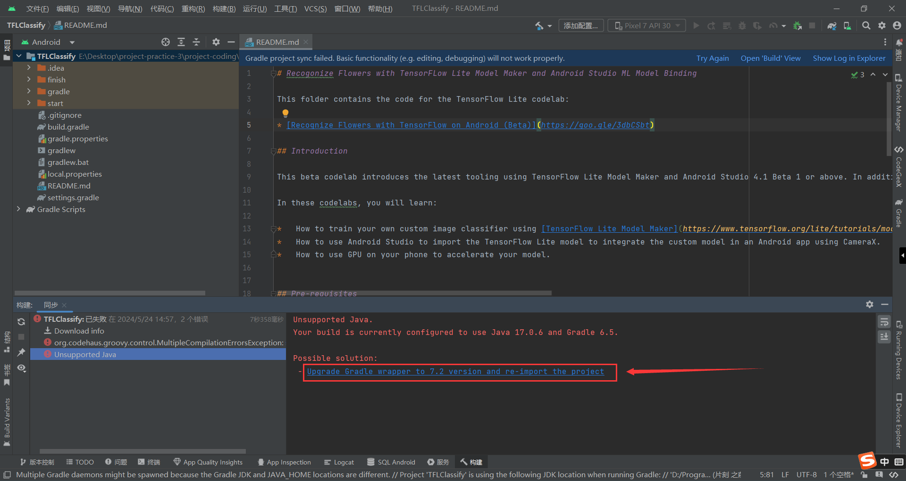

项目中有finish和start两个模块，其中finish模块是已经完成全部功能的项目，我们不需要管它；而start模块是还没完成的项目，我们本次实验就是要将start模块代码补充完整。

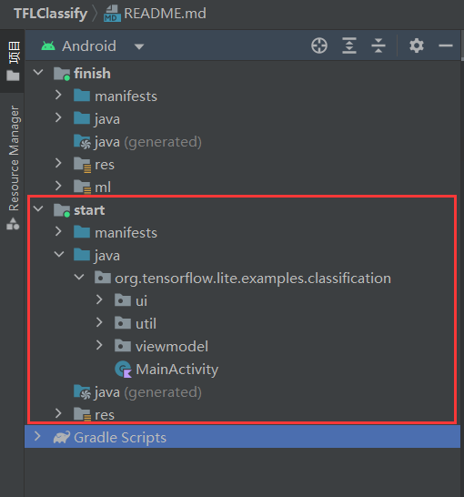

然后我们选择运行start项目，在真机运行

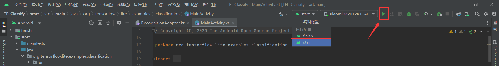

运行效果如下，首先会申请摄像头权限，同意授权后调用摄像头实时捕获场景，并利用随机数表示虚拟的识别结果（后续会进行完善）。

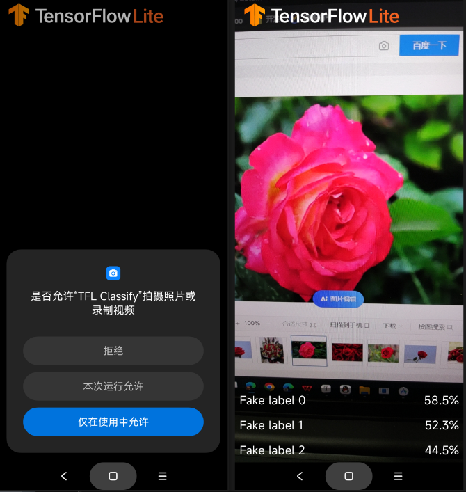

## 向应用中添加TensorFlow Lite

右键“start”模块，然后选择 新建>Other>TensorFlow Lite Model

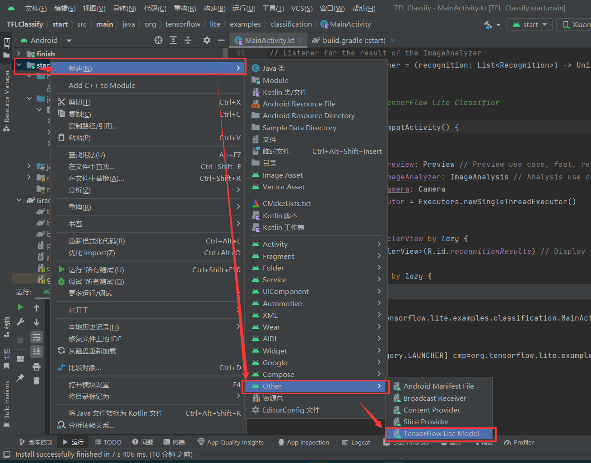

然后选择已经下载的自定义的训练模型，这里我们选择finish模块中ml中的FlowerModel.tflite

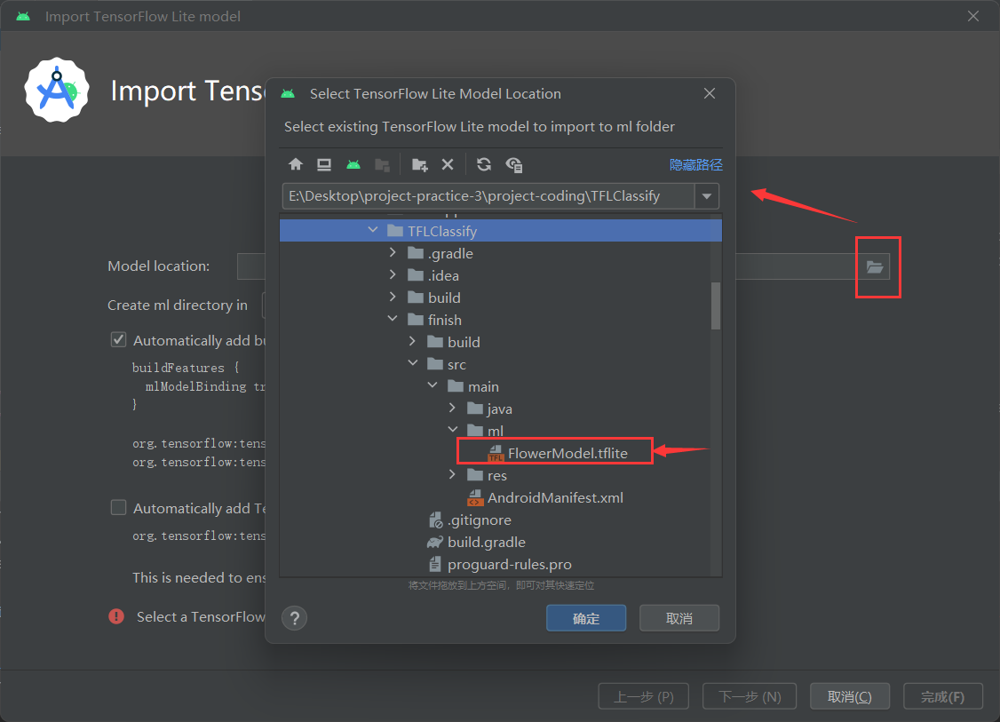

然后可选择TensorFlow Lite GPU依赖，也可以先不选，后续再加，然后点击完成以导入模型，系统将自动下载模型的依赖包并将依赖项添加至模块的build.gradle文件。

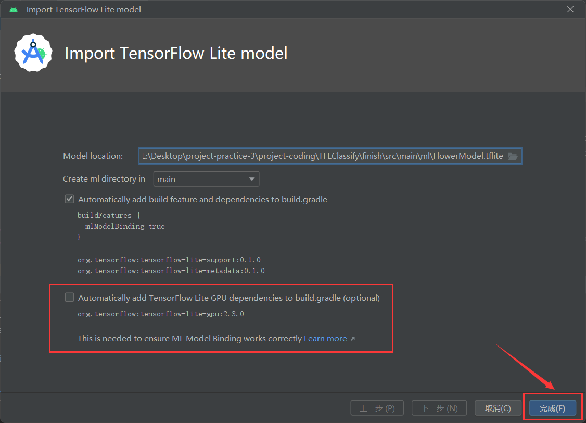

最终TensorFlow Lite模型被成功导入，并生成摘要信息

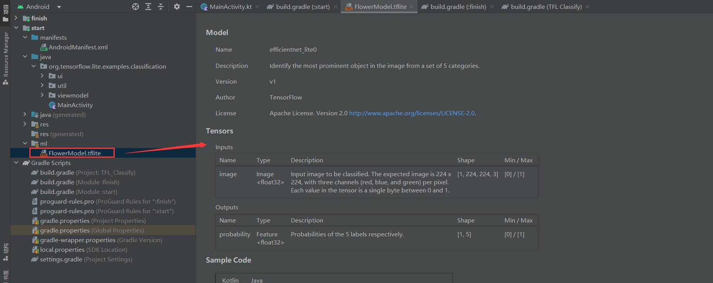

## 查看代码中的TODO项

本项目初始代码中包含了若干的TODO项，以导航项目中未完成之处。我们可以在Android Studio界面的下方找到TODO栏

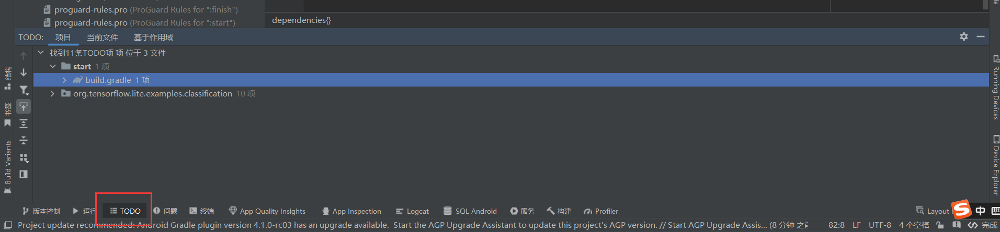

如果没有，可从视图>工具窗口>TODO中打开

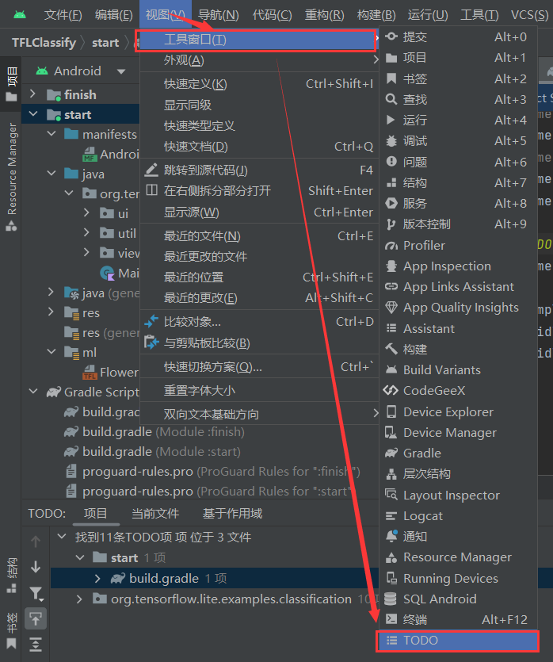

默认情况下了列出项目所有的TODO项，我们可以进一步按照模块分组

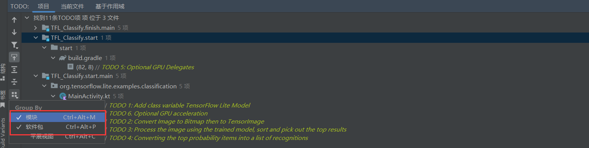

## 补全TODO项位置的代码

1、定位“start”模块**MainActivity.kt**文件中的TODO 1位置，在此添加初始化训练模型的代码

```kotlin
private class ImageAnalyzer(ctx: Context, private val listener: RecognitionListener) :
    ImageAnalysis.Analyzer {
    // TODO 1: Add class variable TensorFlow Lite Model
    private val flowerModel = FlowerModel.newInstance(ctx)
    ……
}
```

2、定位到TODO 2位置，在CameraX的analyze方法内部，需要将摄像头的输入ImageProxy转化为Bitmap对象，并进一步转化为TensorImage对象

```kotlin
override fun analyze(imageProxy: ImageProxy) {
    val items = mutableListOf<Recognition>()
    // TODO 2: Convert Image to Bitmap then to TensorImage
    val tfImage = TensorImage.fromBitmap(toBitmap(imageProxy))
    ……
}
```

3、可以看到TODO 3就在TODO 2下方，我们需要对图像进行处理并生成结果，首先按照属性score对识别结果按照概率从高到低排序，然后列出最高k种可能的结果，k的结果由常量MAX_RESULT_DISPLAY定义

```kotlin
override fun analyze(imageProxy: ImageProxy) {
    ……
    // TODO 2: Convert Image to Bitmap then to TensorImage
    ……
    // TODO 3: Process the image using the trained model, sort and pick out the top results
    val outputs = flowerModel.process(tfImage)
        .probabilityAsCategoryList.apply {
            sortByDescending { it.score } // Sort with highest confidence first
        }.take(MAX_RESULT_DISPLAY) // take the top results
    ……
}
```

4、TODO 4也在下方，在这里我们将识别的结果加入数据对象Recognition中，包含label和score两个元素。后续将用于RecyclerView的数据显示

```kotlin
override fun analyze(imageProxy: ImageProxy) {
    val items = mutableListOf<Recognition>()
    ……
    // TODO 3: Process the image using the trained model, sort and pick out the top results
    ……
    // TODO 4: Converting the top probability items into a list of recognitions
    for (output in outputs) {
        items.add(Recognition(output.label, output.score))
    }
    ……
}
```

然后将TODO 4下面用随机数模拟的代码删掉或注释掉

```kotlin
//            // START - Placeholder code at the start of the codelab. Comment this block of code out.
//            for (i in 0 until MAX_RESULT_DISPLAY){
//                items.add(Recognition("Fake label $i", Random.nextFloat()))
//            }
//            // END - Placeholder code at the start of the codelab. Comment this block of code out.
```

然后可以尝试在真机运行，运行结果如下，界面下方会列出三个可能的识别结果并按照概率从高到低排序：

当摄像头捕捉到的是玫瑰花时，其中识别为玫瑰花（roses）的概率最高，为95.6%

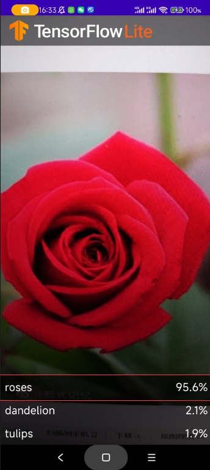

当摄像头捕捉到的是向日葵时，其中识别为向日葵（sunflowers）的概率最高，为92.9%

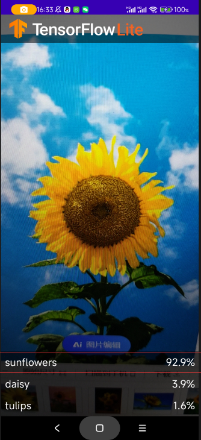

## 可选项：使用GPU硬件加速

1、定位到TODO 5位置，可以看到是在start模块的build.gradle中的依赖项部分，我们在这里添加TensorFlow Lite GPU依赖（如果导入模型时已经勾选了这个依赖就不需要再手动添加了）

```groovy
dependencies {
	……
    // TODO 5: Optional GPU Delegates
    implementation 'org.tensorflow:tensorflow-lite-gpu:2.3.0'
	……
}
```

2、定位到TODO 1和TODO 6处，我们需要修改初始化训练模型的代码，通过懒初始化flowerModel模型，以便在调用process方法时在同一线程中运行。我们需要判断该设备是否兼容GPU，如果兼容则使用GPU进行加速，如果不兼容则启用4个线程来代替。然后在创建模型实例时需要附加上options参数。

```kotlin
// TODO 1: Add class variable TensorFlow Lite Model
// Initializing the flowerModel by lazy so that it runs in the same thread when the process method is called.
private val flowerModel: FlowerModel by lazy{
    // TODO 6. Optional GPU acceleration
    // get CompatibilityList
    val compatList = CompatibilityList()
    // check this device is GPU Compatible or not
    val options = if(compatList.isDelegateSupportedOnThisDevice) {
        // This device is GPU Compatible so we use GPU to speed up.
        Log.d(TAG, "This device is GPU Compatible ")
        Model.Options.Builder().setDevice(Model.Device.GPU).build()
    } else {
        // This device is GPU Incompatible so we use 4 threads to speed up.
        Log.d(TAG, "This device is GPU Incompatible ")
        Model.Options.Builder().setNumThreads(4).build()
    }
    // Initialize the Flower Model with options
    FlowerModel.newInstance(ctx, options)
}
```

最后运行，能够正常运行。查看日志可以看到该设备兼容GPU，所以使用GPU加速。因为模型比较轻量，本身运行就快，所以基本上感知不到运行速度变化，如果模型比较大的话加速效果应该会比较明显。

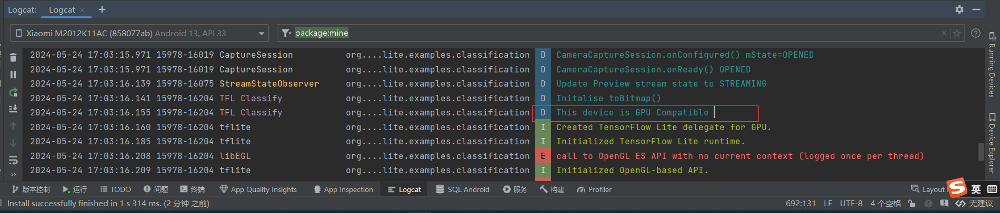

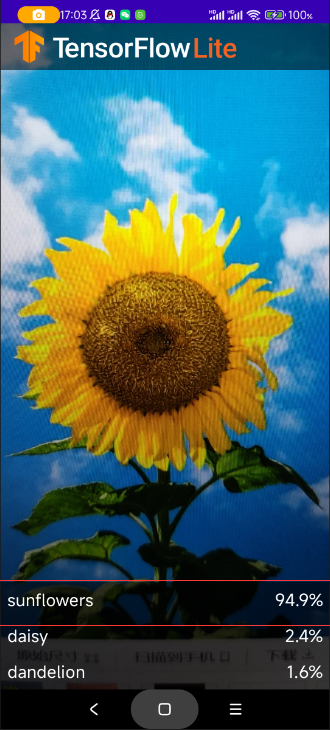

