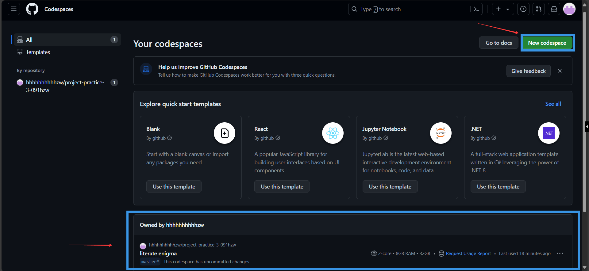
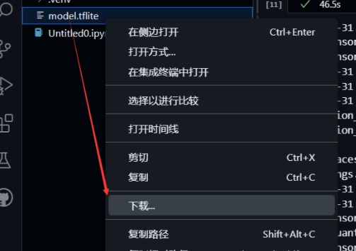
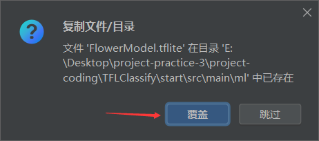
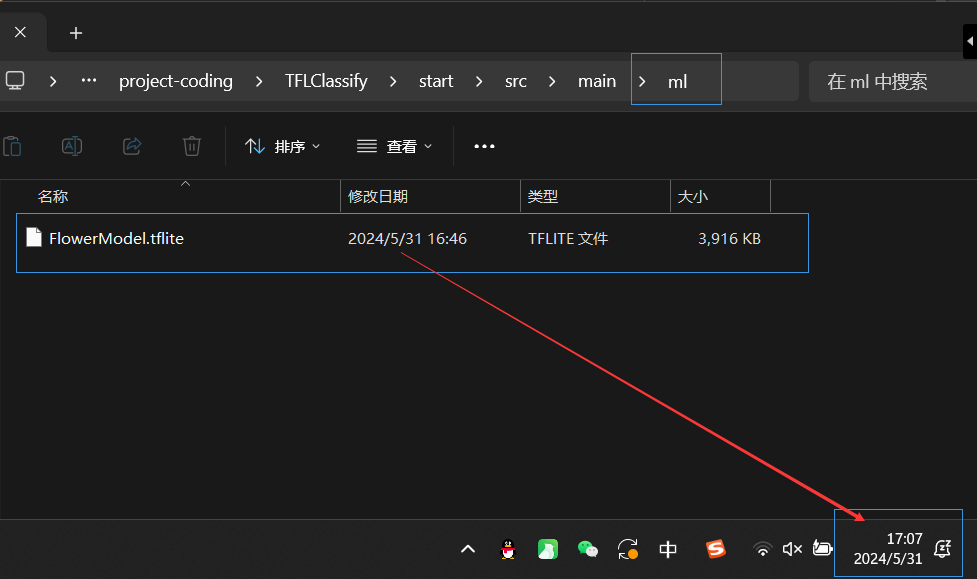

# TensorFlow Lite 模型生成
本次实验需按照教程完成基于TensorFlow Lite Model Maker的花卉
模型生成，并使用实验三的应用验证生成的模型。


## 预备工作
我们在Github的[Codespaces](https://github.com/codespaces)中创建一个新的notebook，选择Python 3.8，然后输入如下代码安装程序运行必备的一些库。这里代码开头的“!”感叹号是告诉notebook把这一行的pip安装指令当做shell指令执行。




```python
!pip install tflite-model-maker
```

    Collecting tflite-model-maker
      Using cached tflite_model_maker-0.4.3-py3-none-any.whl.metadata (5.4 kB)
    Collecting tf-models-official==2.3.0 (from tflite-model-maker)
      Using cached tf_models_official-2.3.0-py2.py3-none-any.whl.metadata (1.3 kB)
    Collecting numpy<1.23.4,>=1.17.3 (from tflite-model-maker)
      Using cached numpy-1.23.3-cp38-cp38-manylinux_2_17_x86_64.manylinux2014_x86_64.whl.metadata (2.3 kB)
    Collecting pillow>=7.0.0 (from tflite-model-maker)
      Using cached pillow-10.3.0-cp38-cp38-manylinux_2_28_x86_64.whl.metadata (9.2 kB)
    Collecting sentencepiece>=0.1.91 (from tflite-model-maker)
      Using cached sentencepiece-0.2.0-cp38-cp38-manylinux_2_17_x86_64.manylinux2014_x86_64.whl.metadata (7.7 kB)
    Collecting tensorflow-datasets>=2.1.0 (from tflite-model-maker)
      Using cached tensorflow_datasets-4.9.2-py3-none-any.whl.metadata (9.0 kB)
    Collecting fire>=0.3.1 (from tflite-model-maker)
      Using cached fire-0.6.0-py2.py3-none-any.whl
    Collecting flatbuffers>=2.0 (from tflite-model-maker)
      Using cached flatbuffers-24.3.25-py2.py3-none-any.whl.metadata (850 bytes)
    Collecting absl-py>=0.10.0 (from tflite-model-maker)
      Using cached absl_py-2.1.0-py3-none-any.whl.metadata (2.3 kB)
    Collecting urllib3!=1.25.0,!=1.25.1,<1.26,>=1.21.1 (from tflite-model-maker)
      Using cached urllib3-1.25.11-py2.py3-none-any.whl.metadata (41 kB)
    Collecting tflite-support>=0.4.2 (from tflite-model-maker)
      Using cached tflite_support-0.4.3-cp38-cp38-manylinux2014_x86_64.whl.metadata (2.4 kB)
    Collecting tensorflowjs<3.19.0,>=2.4.0 (from tflite-model-maker)
      Using cached tensorflowjs-3.18.0-py3-none-any.whl.metadata (1.6 kB)
    Collecting tensorflow>=2.6.0 (from tflite-model-maker)
      Using cached tensorflow-2.13.1-cp38-cp38-manylinux_2_17_x86_64.manylinux2014_x86_64.whl.metadata (3.4 kB)
    Collecting numba>=0.53 (from tflite-model-maker)
      Using cached numba-0.58.1-cp38-cp38-manylinux2014_x86_64.manylinux_2_17_x86_64.whl.metadata (2.7 kB)
    Collecting librosa==0.8.1 (from tflite-model-maker)
      Using cached librosa-0.8.1-py3-none-any.whl.metadata (6.8 kB)
    Collecting lxml>=4.6.1 (from tflite-model-maker)
      Using cached lxml-5.2.2-cp38-cp38-manylinux_2_28_x86_64.whl.metadata (3.4 kB)
    Collecting PyYAML>=5.1 (from tflite-model-maker)
      Using cached PyYAML-6.0.1-cp38-cp38-manylinux_2_17_x86_64.manylinux2014_x86_64.whl.metadata (2.1 kB)
    Collecting matplotlib<3.5.0,>=3.0.3 (from tflite-model-maker)
      Using cached matplotlib-3.4.3-cp38-cp38-manylinux1_x86_64.whl.metadata (5.7 kB)
    Requirement already satisfied: six>=1.12.0 in ./.venv/lib/python3.8/site-packages (from tflite-model-maker) (1.16.0)
    Collecting tensorflow-addons>=0.11.2 (from tflite-model-maker)
      Using cached tensorflow_addons-0.21.0-cp38-cp38-manylinux_2_17_x86_64.manylinux2014_x86_64.whl.metadata (1.8 kB)
    Collecting neural-structured-learning>=1.3.1 (from tflite-model-maker)
      Using cached neural_structured_learning-1.4.0-py2.py3-none-any.whl.metadata (2.5 kB)
    Collecting tensorflow-model-optimization>=0.5 (from tflite-model-maker)
      Using cached tensorflow_model_optimization-0.8.0-py2.py3-none-any.whl.metadata (904 bytes)
    Collecting Cython>=0.29.13 (from tflite-model-maker)
      Using cached Cython-3.0.10-cp38-cp38-manylinux_2_17_x86_64.manylinux2014_x86_64.whl.metadata (3.2 kB)
    Collecting scann==1.2.6 (from tflite-model-maker)
      Using cached scann-1.2.6-cp38-cp38-manylinux2014_x86_64.whl.metadata (4.5 kB)
    Collecting tensorflow-hub<0.13,>=0.7.0 (from tflite-model-maker)
      Using cached tensorflow_hub-0.12.0-py2.py3-none-any.whl.metadata (1.7 kB)
    Collecting audioread>=2.0.0 (from librosa==0.8.1->tflite-model-maker)
      Using cached audioread-3.0.1-py3-none-any.whl.metadata (8.4 kB)
    Collecting scipy>=1.0.0 (from librosa==0.8.1->tflite-model-maker)
      Using cached scipy-1.10.1-cp38-cp38-manylinux_2_17_x86_64.manylinux2014_x86_64.whl.metadata (58 kB)
    Collecting scikit-learn!=0.19.0,>=0.14.0 (from librosa==0.8.1->tflite-model-maker)
      Using cached scikit_learn-1.3.2-cp38-cp38-manylinux_2_17_x86_64.manylinux2014_x86_64.whl.metadata (11 kB)
    Collecting joblib>=0.14 (from librosa==0.8.1->tflite-model-maker)
      Using cached joblib-1.4.2-py3-none-any.whl.metadata (5.4 kB)
    Requirement already satisfied: decorator>=3.0.0 in ./.venv/lib/python3.8/site-packages (from librosa==0.8.1->tflite-model-maker) (5.1.1)
    Collecting resampy>=0.2.2 (from librosa==0.8.1->tflite-model-maker)
      Using cached resampy-0.4.3-py3-none-any.whl.metadata (3.0 kB)
    Collecting soundfile>=0.10.2 (from librosa==0.8.1->tflite-model-maker)
      Using cached soundfile-0.12.1-py2.py3-none-manylinux_2_31_x86_64.whl.metadata (14 kB)
    Collecting pooch>=1.0 (from librosa==0.8.1->tflite-model-maker)
      Using cached pooch-1.8.1-py3-none-any.whl.metadata (9.5 kB)
    Requirement already satisfied: packaging>=20.0 in ./.venv/lib/python3.8/site-packages (from librosa==0.8.1->tflite-model-maker) (24.0)
    Collecting tensorflow>=2.6.0 (from tflite-model-maker)
      Using cached tensorflow-2.8.4-cp38-cp38-manylinux2010_x86_64.whl.metadata (2.9 kB)
    Collecting dataclasses (from tf-models-official==2.3.0->tflite-model-maker)
      Using cached dataclasses-0.6-py3-none-any.whl.metadata (3.0 kB)
    Collecting gin-config (from tf-models-official==2.3.0->tflite-model-maker)
      Using cached gin_config-0.5.0-py3-none-any.whl.metadata (2.9 kB)
    Collecting google-api-python-client>=1.6.7 (from tf-models-official==2.3.0->tflite-model-maker)
      Using cached google_api_python_client-2.131.0-py2.py3-none-any.whl.metadata (6.7 kB)
    Collecting google-cloud-bigquery>=0.31.0 (from tf-models-official==2.3.0->tflite-model-maker)
      Using cached google_cloud_bigquery-3.23.1-py2.py3-none-any.whl.metadata (8.9 kB)
    Collecting kaggle>=1.3.9 (from tf-models-official==2.3.0->tflite-model-maker)
      Using cached kaggle-1.6.14-py3-none-any.whl
    Collecting opencv-python-headless (from tf-models-official==2.3.0->tflite-model-maker)
      Using cached opencv_python_headless-4.9.0.80-cp37-abi3-manylinux_2_17_x86_64.manylinux2014_x86_64.whl.metadata (20 kB)
    Collecting pandas>=0.22.0 (from tf-models-official==2.3.0->tflite-model-maker)
      Using cached pandas-2.0.3-cp38-cp38-manylinux_2_17_x86_64.manylinux2014_x86_64.whl.metadata (18 kB)
    Requirement already satisfied: psutil>=5.4.3 in ./.venv/lib/python3.8/site-packages (from tf-models-official==2.3.0->tflite-model-maker) (5.9.8)
    Collecting py-cpuinfo>=3.3.0 (from tf-models-official==2.3.0->tflite-model-maker)
      Using cached py_cpuinfo-9.0.0-py3-none-any.whl.metadata (794 bytes)
    Collecting tf-slim>=1.1.0 (from tf-models-official==2.3.0->tflite-model-maker)
      Using cached tf_slim-1.1.0-py2.py3-none-any.whl.metadata (1.6 kB)
    Collecting termcolor (from fire>=0.3.1->tflite-model-maker)
      Using cached termcolor-2.4.0-py3-none-any.whl.metadata (6.1 kB)
    Collecting cycler>=0.10 (from matplotlib<3.5.0,>=3.0.3->tflite-model-maker)
      Using cached cycler-0.12.1-py3-none-any.whl.metadata (3.8 kB)
    Collecting kiwisolver>=1.0.1 (from matplotlib<3.5.0,>=3.0.3->tflite-model-maker)
      Using cached kiwisolver-1.4.5-cp38-cp38-manylinux_2_5_x86_64.manylinux1_x86_64.whl.metadata (6.4 kB)
    Collecting pyparsing>=2.2.1 (from matplotlib<3.5.0,>=3.0.3->tflite-model-maker)
      Using cached pyparsing-3.1.2-py3-none-any.whl.metadata (5.1 kB)
    Requirement already satisfied: python-dateutil>=2.7 in ./.venv/lib/python3.8/site-packages (from matplotlib<3.5.0,>=3.0.3->tflite-model-maker) (2.9.0.post0)
    Collecting attrs (from neural-structured-learning>=1.3.1->tflite-model-maker)
      Using cached attrs-23.2.0-py3-none-any.whl.metadata (9.5 kB)
    Collecting llvmlite<0.42,>=0.41.0dev0 (from numba>=0.53->tflite-model-maker)
      Using cached llvmlite-0.41.1-cp38-cp38-manylinux_2_17_x86_64.manylinux2014_x86_64.whl.metadata (4.8 kB)
    Requirement already satisfied: importlib-metadata in ./.venv/lib/python3.8/site-packages (from numba>=0.53->tflite-model-maker) (7.1.0)
    Collecting astunparse>=1.6.0 (from tensorflow>=2.6.0->tflite-model-maker)
      Using cached astunparse-1.6.3-py2.py3-none-any.whl.metadata (4.4 kB)
    Collecting gast>=0.2.1 (from tensorflow>=2.6.0->tflite-model-maker)
      Using cached gast-0.5.4-py3-none-any.whl.metadata (1.3 kB)
    Collecting google-pasta>=0.1.1 (from tensorflow>=2.6.0->tflite-model-maker)
      Using cached google_pasta-0.2.0-py3-none-any.whl.metadata (814 bytes)
    Collecting h5py>=2.9.0 (from tensorflow>=2.6.0->tflite-model-maker)
      Using cached h5py-3.11.0-cp38-cp38-manylinux_2_17_x86_64.manylinux2014_x86_64.whl.metadata (2.5 kB)
    Collecting keras-preprocessing>=1.1.1 (from tensorflow>=2.6.0->tflite-model-maker)
      Using cached Keras_Preprocessing-1.1.2-py2.py3-none-any.whl.metadata (1.9 kB)
    Collecting libclang>=9.0.1 (from tensorflow>=2.6.0->tflite-model-maker)
      Using cached libclang-18.1.1-py2.py3-none-manylinux2010_x86_64.whl.metadata (5.2 kB)
    Collecting opt-einsum>=2.3.2 (from tensorflow>=2.6.0->tflite-model-maker)
      Using cached opt_einsum-3.3.0-py3-none-any.whl.metadata (6.5 kB)
    Collecting protobuf<3.20,>=3.9.2 (from tensorflow>=2.6.0->tflite-model-maker)
      Using cached protobuf-3.19.6-cp38-cp38-manylinux_2_17_x86_64.manylinux2014_x86_64.whl.metadata (787 bytes)
    Collecting setuptools (from tensorflow>=2.6.0->tflite-model-maker)
      Using cached setuptools-70.0.0-py3-none-any.whl.metadata (5.9 kB)
    Requirement already satisfied: typing-extensions>=3.6.6 in ./.venv/lib/python3.8/site-packages (from tensorflow>=2.6.0->tflite-model-maker) (4.12.0)
    Collecting wrapt>=1.11.0 (from tensorflow>=2.6.0->tflite-model-maker)
      Using cached wrapt-1.16.0-cp38-cp38-manylinux_2_5_x86_64.manylinux1_x86_64.manylinux_2_17_x86_64.manylinux2014_x86_64.whl.metadata (6.6 kB)
    Collecting tensorboard<2.9,>=2.8 (from tensorflow>=2.6.0->tflite-model-maker)
      Using cached tensorboard-2.8.0-py3-none-any.whl.metadata (1.9 kB)
    Collecting tensorflow-estimator<2.9,>=2.8 (from tensorflow>=2.6.0->tflite-model-maker)
      Using cached tensorflow_estimator-2.8.0-py2.py3-none-any.whl.metadata (1.3 kB)
    Collecting keras<2.9,>=2.8.0rc0 (from tensorflow>=2.6.0->tflite-model-maker)
      Using cached keras-2.8.0-py2.py3-none-any.whl.metadata (1.3 kB)
    Collecting tensorflow-io-gcs-filesystem>=0.23.1 (from tensorflow>=2.6.0->tflite-model-maker)
      Using cached tensorflow_io_gcs_filesystem-0.34.0-cp38-cp38-manylinux_2_12_x86_64.manylinux2010_x86_64.whl.metadata (14 kB)
    Collecting grpcio<2.0,>=1.24.3 (from tensorflow>=2.6.0->tflite-model-maker)
      Using cached grpcio-1.64.0-cp38-cp38-manylinux_2_17_x86_64.manylinux2014_x86_64.whl.metadata (3.3 kB)
    Collecting typeguard<3.0.0,>=2.7 (from tensorflow-addons>=0.11.2->tflite-model-maker)
      Using cached typeguard-2.13.3-py3-none-any.whl.metadata (3.6 kB)
    Collecting array-record (from tensorflow-datasets>=2.1.0->tflite-model-maker)
      Using cached array_record-0.4.0-py38-none-any.whl.metadata (502 bytes)
    Collecting click (from tensorflow-datasets>=2.1.0->tflite-model-maker)
      Using cached click-8.1.7-py3-none-any.whl.metadata (3.0 kB)
    Collecting dm-tree (from tensorflow-datasets>=2.1.0->tflite-model-maker)
      Using cached dm_tree-0.1.8-cp38-cp38-manylinux_2_17_x86_64.manylinux2014_x86_64.whl.metadata (1.9 kB)
    Collecting etils>=0.9.0 (from etils[enp,epath]>=0.9.0->tensorflow-datasets>=2.1.0->tflite-model-maker)
      Using cached etils-1.3.0-py3-none-any.whl.metadata (5.5 kB)
    Collecting promise (from tensorflow-datasets>=2.1.0->tflite-model-maker)
      Using cached promise-2.3-py3-none-any.whl
    INFO: pip is looking at multiple versions of tensorflow-datasets to determine which version is compatible with other requirements. This could take a while.
    Collecting tensorflow-datasets>=2.1.0 (from tflite-model-maker)
      Using cached tensorflow_datasets-4.9.1-py3-none-any.whl.metadata (9.0 kB)
      Using cached tensorflow_datasets-4.9.0-py3-none-any.whl.metadata (9.0 kB)
    Collecting requests>=2.19.0 (from tensorflow-datasets>=2.1.0->tflite-model-maker)
      Using cached requests-2.32.3-py3-none-any.whl.metadata (4.6 kB)
    Collecting tensorflow-metadata (from tensorflow-datasets>=2.1.0->tflite-model-maker)
      Using cached tensorflow_metadata-1.14.0-py3-none-any.whl.metadata (2.1 kB)
    Collecting toml (from tensorflow-datasets>=2.1.0->tflite-model-maker)
      Using cached toml-0.10.2-py2.py3-none-any.whl.metadata (7.1 kB)
    Collecting tqdm (from tensorflow-datasets>=2.1.0->tflite-model-maker)
      Using cached tqdm-4.66.4-py3-none-any.whl.metadata (57 kB)
    Collecting importlib-resources (from tensorflow-datasets>=2.1.0->tflite-model-maker)
      Using cached importlib_resources-6.4.0-py3-none-any.whl.metadata (3.9 kB)
    Collecting absl-py>=0.10.0 (from tflite-model-maker)
      Using cached absl_py-1.4.0-py3-none-any.whl.metadata (2.3 kB)
    Collecting packaging>=20.0 (from librosa==0.8.1->tflite-model-maker)
      Using cached packaging-20.9-py2.py3-none-any.whl.metadata (13 kB)
    Collecting sounddevice>=0.4.4 (from tflite-support>=0.4.2->tflite-model-maker)
      Using cached sounddevice-0.4.7-py3-none-any.whl.metadata (1.4 kB)
    Collecting pybind11>=2.6.0 (from tflite-support>=0.4.2->tflite-model-maker)
      Using cached pybind11-2.12.0-py3-none-any.whl.metadata (9.5 kB)
    Collecting wheel<1.0,>=0.23.0 (from astunparse>=1.6.0->tensorflow>=2.6.0->tflite-model-maker)
      Using cached wheel-0.43.0-py3-none-any.whl.metadata (2.2 kB)
    Requirement already satisfied: zipp in ./.venv/lib/python3.8/site-packages (from etils[enp,epath]>=0.9.0->tensorflow-datasets>=2.1.0->tflite-model-maker) (3.19.0)
    Collecting httplib2<1.dev0,>=0.19.0 (from google-api-python-client>=1.6.7->tf-models-official==2.3.0->tflite-model-maker)
      Using cached httplib2-0.22.0-py3-none-any.whl.metadata (2.6 kB)
    Collecting google-auth!=2.24.0,!=2.25.0,<3.0.0.dev0,>=1.32.0 (from google-api-python-client>=1.6.7->tf-models-official==2.3.0->tflite-model-maker)
      Using cached google_auth-2.29.0-py2.py3-none-any.whl.metadata (4.7 kB)
    Collecting google-auth-httplib2<1.0.0,>=0.2.0 (from google-api-python-client>=1.6.7->tf-models-official==2.3.0->tflite-model-maker)
      Using cached google_auth_httplib2-0.2.0-py2.py3-none-any.whl.metadata (2.2 kB)
    Collecting google-api-core!=2.0.*,!=2.1.*,!=2.2.*,!=2.3.0,<3.0.0.dev0,>=1.31.5 (from google-api-python-client>=1.6.7->tf-models-official==2.3.0->tflite-model-maker)
      Using cached google_api_core-2.19.0-py3-none-any.whl.metadata (2.7 kB)
    Collecting uritemplate<5,>=3.0.1 (from google-api-python-client>=1.6.7->tf-models-official==2.3.0->tflite-model-maker)
      Using cached uritemplate-4.1.1-py2.py3-none-any.whl.metadata (2.9 kB)
    Collecting google-cloud-core<3.0.0dev,>=1.6.0 (from google-cloud-bigquery>=0.31.0->tf-models-official==2.3.0->tflite-model-maker)
      Using cached google_cloud_core-2.4.1-py2.py3-none-any.whl.metadata (2.7 kB)
    Collecting google-resumable-media<3.0dev,>=0.6.0 (from google-cloud-bigquery>=0.31.0->tf-models-official==2.3.0->tflite-model-maker)
      Using cached google_resumable_media-2.7.0-py2.py3-none-any.whl.metadata (2.2 kB)
    Collecting certifi>=2023.7.22 (from kaggle>=1.3.9->tf-models-official==2.3.0->tflite-model-maker)
      Using cached certifi-2024.2.2-py3-none-any.whl.metadata (2.2 kB)
    Collecting python-slugify (from kaggle>=1.3.9->tf-models-official==2.3.0->tflite-model-maker)
      Using cached python_slugify-8.0.4-py2.py3-none-any.whl.metadata (8.5 kB)
    Collecting bleach (from kaggle>=1.3.9->tf-models-official==2.3.0->tflite-model-maker)
      Using cached bleach-6.1.0-py3-none-any.whl.metadata (30 kB)
    Collecting pytz>=2020.1 (from pandas>=0.22.0->tf-models-official==2.3.0->tflite-model-maker)
      Using cached pytz-2024.1-py2.py3-none-any.whl.metadata (22 kB)
    Collecting tzdata>=2022.1 (from pandas>=0.22.0->tf-models-official==2.3.0->tflite-model-maker)
      Using cached tzdata-2024.1-py2.py3-none-any.whl.metadata (1.4 kB)
    Requirement already satisfied: platformdirs>=2.5.0 in ./.venv/lib/python3.8/site-packages (from pooch>=1.0->librosa==0.8.1->tflite-model-maker) (4.2.2)
    Collecting charset-normalizer<4,>=2 (from requests>=2.19.0->tensorflow-datasets>=2.1.0->tflite-model-maker)
      Using cached charset_normalizer-3.3.2-cp38-cp38-manylinux_2_17_x86_64.manylinux2014_x86_64.whl.metadata (33 kB)
    Collecting idna<4,>=2.5 (from requests>=2.19.0->tensorflow-datasets>=2.1.0->tflite-model-maker)
      Using cached idna-3.7-py3-none-any.whl.metadata (9.9 kB)
    Collecting threadpoolctl>=2.0.0 (from scikit-learn!=0.19.0,>=0.14.0->librosa==0.8.1->tflite-model-maker)
      Using cached threadpoolctl-3.5.0-py3-none-any.whl.metadata (13 kB)
    Collecting CFFI>=1.0 (from sounddevice>=0.4.4->tflite-support>=0.4.2->tflite-model-maker)
      Using cached cffi-1.16.0-cp38-cp38-manylinux_2_17_x86_64.manylinux2014_x86_64.whl.metadata (1.5 kB)
    Collecting google-auth-oauthlib<0.5,>=0.4.1 (from tensorboard<2.9,>=2.8->tensorflow>=2.6.0->tflite-model-maker)
      Using cached google_auth_oauthlib-0.4.6-py2.py3-none-any.whl.metadata (2.7 kB)
    Collecting markdown>=2.6.8 (from tensorboard<2.9,>=2.8->tensorflow>=2.6.0->tflite-model-maker)
      Using cached Markdown-3.6-py3-none-any.whl.metadata (7.0 kB)
    Collecting tensorboard-data-server<0.7.0,>=0.6.0 (from tensorboard<2.9,>=2.8->tensorflow>=2.6.0->tflite-model-maker)
      Using cached tensorboard_data_server-0.6.1-py3-none-manylinux2010_x86_64.whl.metadata (1.1 kB)
    Collecting tensorboard-plugin-wit>=1.6.0 (from tensorboard<2.9,>=2.8->tensorflow>=2.6.0->tflite-model-maker)
      Using cached tensorboard_plugin_wit-1.8.1-py3-none-any.whl.metadata (873 bytes)
    Collecting werkzeug>=0.11.15 (from tensorboard<2.9,>=2.8->tensorflow>=2.6.0->tflite-model-maker)
      Using cached werkzeug-3.0.3-py3-none-any.whl.metadata (3.7 kB)
    Collecting googleapis-common-protos<2,>=1.52.0 (from tensorflow-metadata->tensorflow-datasets>=2.1.0->tflite-model-maker)
      Using cached googleapis_common_protos-1.63.0-py2.py3-none-any.whl.metadata (1.5 kB)
    INFO: pip is looking at multiple versions of tensorflow-metadata to determine which version is compatible with other requirements. This could take a while.
    Collecting tensorflow-metadata (from tensorflow-datasets>=2.1.0->tflite-model-maker)
      Using cached tensorflow_metadata-1.13.1-py3-none-any.whl.metadata (2.1 kB)
      Using cached tensorflow_metadata-1.13.0-py3-none-any.whl.metadata (2.1 kB)
    Collecting pycparser (from CFFI>=1.0->sounddevice>=0.4.4->tflite-support>=0.4.2->tflite-model-maker)
      Using cached pycparser-2.22-py3-none-any.whl.metadata (943 bytes)
    Collecting proto-plus<2.0.0dev,>=1.22.3 (from google-api-core!=2.0.*,!=2.1.*,!=2.2.*,!=2.3.0,<3.0.0.dev0,>=1.31.5->google-api-python-client>=1.6.7->tf-models-official==2.3.0->tflite-model-maker)
      Using cached proto_plus-1.23.0-py3-none-any.whl.metadata (2.2 kB)
    Collecting grpcio-status<2.0.dev0,>=1.33.2 (from google-api-core[grpc]!=2.0.*,!=2.1.*,!=2.10.*,!=2.2.*,!=2.3.*,!=2.4.*,!=2.5.*,!=2.6.*,!=2.7.*,!=2.8.*,!=2.9.*,<3.0.0dev,>=1.34.1->google-cloud-bigquery>=0.31.0->tf-models-official==2.3.0->tflite-model-maker)
      Using cached grpcio_status-1.64.0-py3-none-any.whl.metadata (1.1 kB)
    Collecting cachetools<6.0,>=2.0.0 (from google-auth!=2.24.0,!=2.25.0,<3.0.0.dev0,>=1.32.0->google-api-python-client>=1.6.7->tf-models-official==2.3.0->tflite-model-maker)
      Using cached cachetools-5.3.3-py3-none-any.whl.metadata (5.3 kB)
    Collecting pyasn1-modules>=0.2.1 (from google-auth!=2.24.0,!=2.25.0,<3.0.0.dev0,>=1.32.0->google-api-python-client>=1.6.7->tf-models-official==2.3.0->tflite-model-maker)
      Using cached pyasn1_modules-0.4.0-py3-none-any.whl.metadata (3.4 kB)
    Collecting rsa<5,>=3.1.4 (from google-auth!=2.24.0,!=2.25.0,<3.0.0.dev0,>=1.32.0->google-api-python-client>=1.6.7->tf-models-official==2.3.0->tflite-model-maker)
      Using cached rsa-4.9-py3-none-any.whl.metadata (4.2 kB)
    Collecting requests-oauthlib>=0.7.0 (from google-auth-oauthlib<0.5,>=0.4.1->tensorboard<2.9,>=2.8->tensorflow>=2.6.0->tflite-model-maker)
      Using cached requests_oauthlib-2.0.0-py2.py3-none-any.whl.metadata (11 kB)
    Collecting google-crc32c<2.0dev,>=1.0 (from google-resumable-media<3.0dev,>=0.6.0->google-cloud-bigquery>=0.31.0->tf-models-official==2.3.0->tflite-model-maker)
      Using cached google_crc32c-1.5.0-cp38-cp38-manylinux_2_17_x86_64.manylinux2014_x86_64.whl.metadata (2.3 kB)
    Collecting MarkupSafe>=2.1.1 (from werkzeug>=0.11.15->tensorboard<2.9,>=2.8->tensorflow>=2.6.0->tflite-model-maker)
      Using cached MarkupSafe-2.1.5-cp38-cp38-manylinux_2_17_x86_64.manylinux2014_x86_64.whl.metadata (3.0 kB)
    Collecting webencodings (from bleach->kaggle>=1.3.9->tf-models-official==2.3.0->tflite-model-maker)
      Using cached webencodings-0.5.1-py2.py3-none-any.whl.metadata (2.1 kB)
    Collecting text-unidecode>=1.3 (from python-slugify->kaggle>=1.3.9->tf-models-official==2.3.0->tflite-model-maker)
      Using cached text_unidecode-1.3-py2.py3-none-any.whl.metadata (2.4 kB)
    INFO: pip is looking at multiple versions of grpcio-status to determine which version is compatible with other requirements. This could take a while.
    Collecting grpcio-status<2.0.dev0,>=1.33.2 (from google-api-core[grpc]!=2.0.*,!=2.1.*,!=2.10.*,!=2.2.*,!=2.3.*,!=2.4.*,!=2.5.*,!=2.6.*,!=2.7.*,!=2.8.*,!=2.9.*,<3.0.0dev,>=1.34.1->google-cloud-bigquery>=0.31.0->tf-models-official==2.3.0->tflite-model-maker)
      Using cached grpcio_status-1.63.0-py3-none-any.whl.metadata (1.1 kB)
      Using cached grpcio_status-1.62.2-py3-none-any.whl.metadata (1.3 kB)
      Using cached grpcio_status-1.62.1-py3-none-any.whl.metadata (1.3 kB)
      Using cached grpcio_status-1.62.0-py3-none-any.whl.metadata (1.3 kB)
      Using cached grpcio_status-1.60.1-py3-none-any.whl.metadata (1.3 kB)
      Using cached grpcio_status-1.60.0-py3-none-any.whl.metadata (1.3 kB)
      Using cached grpcio_status-1.59.3-py3-none-any.whl.metadata (1.3 kB)
    INFO: pip is still looking at multiple versions of grpcio-status to determine which version is compatible with other requirements. This could take a while.
      Using cached grpcio_status-1.59.2-py3-none-any.whl.metadata (1.3 kB)
      Using cached grpcio_status-1.59.0-py3-none-any.whl.metadata (1.3 kB)
      Using cached grpcio_status-1.58.0-py3-none-any.whl.metadata (1.3 kB)
      Using cached grpcio_status-1.57.0-py3-none-any.whl.metadata (1.2 kB)
      Using cached grpcio_status-1.56.2-py3-none-any.whl.metadata (1.3 kB)
    INFO: This is taking longer than usual. You might need to provide the dependency resolver with stricter constraints to reduce runtime. See https://pip.pypa.io/warnings/backtracking for guidance. If you want to abort this run, press Ctrl + C.
      Using cached grpcio_status-1.56.0-py3-none-any.whl.metadata (1.3 kB)
      Using cached grpcio_status-1.55.3-py3-none-any.whl.metadata (1.3 kB)
      Using cached grpcio_status-1.54.3-py3-none-any.whl.metadata (1.3 kB)
      Using cached grpcio_status-1.54.2-py3-none-any.whl.metadata (1.3 kB)
      Using cached grpcio_status-1.54.0-py3-none-any.whl.metadata (1.3 kB)
      Using cached grpcio_status-1.53.2-py3-none-any.whl.metadata (1.3 kB)
      Using cached grpcio_status-1.53.1-py3-none-any.whl.metadata (1.3 kB)
      Using cached grpcio_status-1.53.0-py3-none-any.whl.metadata (1.3 kB)
      Using cached grpcio_status-1.51.3-py3-none-any.whl.metadata (1.3 kB)
      Using cached grpcio_status-1.51.1-py3-none-any.whl.metadata (1.3 kB)
      Using cached grpcio_status-1.50.0-py3-none-any.whl.metadata (1.3 kB)
      Using cached grpcio_status-1.49.1-py3-none-any.whl.metadata (1.3 kB)
      Using cached grpcio_status-1.48.2-py3-none-any.whl.metadata (1.2 kB)
    Collecting pyasn1<0.7.0,>=0.4.6 (from pyasn1-modules>=0.2.1->google-auth!=2.24.0,!=2.25.0,<3.0.0.dev0,>=1.32.0->google-api-python-client>=1.6.7->tf-models-official==2.3.0->tflite-model-maker)
      Using cached pyasn1-0.6.0-py2.py3-none-any.whl.metadata (8.3 kB)
    Collecting oauthlib>=3.0.0 (from requests-oauthlib>=0.7.0->google-auth-oauthlib<0.5,>=0.4.1->tensorboard<2.9,>=2.8->tensorflow>=2.6.0->tflite-model-maker)
      Using cached oauthlib-3.2.2-py3-none-any.whl.metadata (7.5 kB)
    Using cached tflite_model_maker-0.4.3-py3-none-any.whl (580 kB)
    Using cached librosa-0.8.1-py3-none-any.whl (203 kB)
    Using cached scann-1.2.6-cp38-cp38-manylinux2014_x86_64.whl (10.9 MB)
    Using cached tf_models_official-2.3.0-py2.py3-none-any.whl (840 kB)
    Using cached Cython-3.0.10-cp38-cp38-manylinux_2_17_x86_64.manylinux2014_x86_64.whl (3.6 MB)
    Using cached flatbuffers-24.3.25-py2.py3-none-any.whl (26 kB)
    Using cached lxml-5.2.2-cp38-cp38-manylinux_2_28_x86_64.whl (5.1 MB)
    Using cached matplotlib-3.4.3-cp38-cp38-manylinux1_x86_64.whl (10.3 MB)
    Using cached neural_structured_learning-1.4.0-py2.py3-none-any.whl (128 kB)
    Using cached numba-0.58.1-cp38-cp38-manylinux2014_x86_64.manylinux_2_17_x86_64.whl (3.7 MB)
    Using cached numpy-1.23.3-cp38-cp38-manylinux_2_17_x86_64.manylinux2014_x86_64.whl (17.1 MB)
    Using cached pillow-10.3.0-cp38-cp38-manylinux_2_28_x86_64.whl (4.5 MB)
    Using cached PyYAML-6.0.1-cp38-cp38-manylinux_2_17_x86_64.manylinux2014_x86_64.whl (736 kB)
    Using cached sentencepiece-0.2.0-cp38-cp38-manylinux_2_17_x86_64.manylinux2014_x86_64.whl (1.3 MB)
    Using cached tensorflow-2.8.4-cp38-cp38-manylinux2010_x86_64.whl (498.0 MB)
    Using cached tensorflow_addons-0.21.0-cp38-cp38-manylinux_2_17_x86_64.manylinux2014_x86_64.whl (612 kB)
    Using cached tensorflow_datasets-4.9.0-py3-none-any.whl (5.4 MB)
    Using cached tensorflow_hub-0.12.0-py2.py3-none-any.whl (108 kB)
    Using cached tensorflow_model_optimization-0.8.0-py2.py3-none-any.whl (242 kB)
    Using cached absl_py-1.4.0-py3-none-any.whl (126 kB)
    Using cached tensorflowjs-3.18.0-py3-none-any.whl (77 kB)
    Using cached tflite_support-0.4.3-cp38-cp38-manylinux2014_x86_64.whl (60.8 MB)
    Using cached urllib3-1.25.11-py2.py3-none-any.whl (127 kB)
    Using cached astunparse-1.6.3-py2.py3-none-any.whl (12 kB)
    Using cached audioread-3.0.1-py3-none-any.whl (23 kB)
    Using cached cycler-0.12.1-py3-none-any.whl (8.3 kB)
    Using cached dm_tree-0.1.8-cp38-cp38-manylinux_2_17_x86_64.manylinux2014_x86_64.whl (152 kB)
    Using cached etils-1.3.0-py3-none-any.whl (126 kB)
    Using cached gast-0.5.4-py3-none-any.whl (19 kB)
    Using cached google_api_python_client-2.131.0-py2.py3-none-any.whl (11.7 MB)
    Using cached google_cloud_bigquery-3.23.1-py2.py3-none-any.whl (237 kB)
    Using cached google_pasta-0.2.0-py3-none-any.whl (57 kB)
    Using cached grpcio-1.64.0-cp38-cp38-manylinux_2_17_x86_64.manylinux2014_x86_64.whl (5.6 MB)
    Using cached h5py-3.11.0-cp38-cp38-manylinux_2_17_x86_64.manylinux2014_x86_64.whl (5.3 MB)
    Using cached joblib-1.4.2-py3-none-any.whl (301 kB)
    Using cached keras-2.8.0-py2.py3-none-any.whl (1.4 MB)
    Using cached Keras_Preprocessing-1.1.2-py2.py3-none-any.whl (42 kB)
    Using cached kiwisolver-1.4.5-cp38-cp38-manylinux_2_5_x86_64.manylinux1_x86_64.whl (1.2 MB)
    Using cached libclang-18.1.1-py2.py3-none-manylinux2010_x86_64.whl (24.5 MB)
    Using cached llvmlite-0.41.1-cp38-cp38-manylinux_2_17_x86_64.manylinux2014_x86_64.whl (43.6 MB)
    Using cached opt_einsum-3.3.0-py3-none-any.whl (65 kB)
    Using cached packaging-20.9-py2.py3-none-any.whl (40 kB)
    Using cached pandas-2.0.3-cp38-cp38-manylinux_2_17_x86_64.manylinux2014_x86_64.whl (12.4 MB)
    Using cached pooch-1.8.1-py3-none-any.whl (62 kB)
    Using cached protobuf-3.19.6-cp38-cp38-manylinux_2_17_x86_64.manylinux2014_x86_64.whl (1.1 MB)
    Using cached py_cpuinfo-9.0.0-py3-none-any.whl (22 kB)
    Using cached pybind11-2.12.0-py3-none-any.whl (234 kB)
    Using cached pyparsing-3.1.2-py3-none-any.whl (103 kB)
    Using cached requests-2.32.3-py3-none-any.whl (64 kB)
    Using cached resampy-0.4.3-py3-none-any.whl (3.1 MB)
    Using cached scikit_learn-1.3.2-cp38-cp38-manylinux_2_17_x86_64.manylinux2014_x86_64.whl (11.1 MB)
    Using cached scipy-1.10.1-cp38-cp38-manylinux_2_17_x86_64.manylinux2014_x86_64.whl (34.5 MB)
    Using cached sounddevice-0.4.7-py3-none-any.whl (32 kB)
    Using cached soundfile-0.12.1-py2.py3-none-manylinux_2_31_x86_64.whl (1.2 MB)
    Using cached tensorboard-2.8.0-py3-none-any.whl (5.8 MB)
    Using cached setuptools-70.0.0-py3-none-any.whl (863 kB)
    Using cached tensorflow_estimator-2.8.0-py2.py3-none-any.whl (462 kB)
    Using cached tensorflow_io_gcs_filesystem-0.34.0-cp38-cp38-manylinux_2_12_x86_64.manylinux2010_x86_64.whl (2.4 MB)
    Using cached termcolor-2.4.0-py3-none-any.whl (7.7 kB)
    Using cached tf_slim-1.1.0-py2.py3-none-any.whl (352 kB)
    Using cached typeguard-2.13.3-py3-none-any.whl (17 kB)
    Using cached wrapt-1.16.0-cp38-cp38-manylinux_2_5_x86_64.manylinux1_x86_64.manylinux_2_17_x86_64.manylinux2014_x86_64.whl (83 kB)
    Using cached array_record-0.4.0-py38-none-any.whl (3.0 MB)
    Using cached attrs-23.2.0-py3-none-any.whl (60 kB)
    Using cached click-8.1.7-py3-none-any.whl (97 kB)
    Using cached dataclasses-0.6-py3-none-any.whl (14 kB)
    Using cached gin_config-0.5.0-py3-none-any.whl (61 kB)
    Using cached importlib_resources-6.4.0-py3-none-any.whl (38 kB)
    Using cached opencv_python_headless-4.9.0.80-cp37-abi3-manylinux_2_17_x86_64.manylinux2014_x86_64.whl (49.6 MB)
    Using cached tensorflow_metadata-1.13.0-py3-none-any.whl (53 kB)
    Using cached toml-0.10.2-py2.py3-none-any.whl (16 kB)
    Using cached tqdm-4.66.4-py3-none-any.whl (78 kB)
    Using cached certifi-2024.2.2-py3-none-any.whl (163 kB)
    Using cached cffi-1.16.0-cp38-cp38-manylinux_2_17_x86_64.manylinux2014_x86_64.whl (444 kB)
    Using cached charset_normalizer-3.3.2-cp38-cp38-manylinux_2_17_x86_64.manylinux2014_x86_64.whl (141 kB)
    Using cached google_api_core-2.19.0-py3-none-any.whl (139 kB)
    Using cached google_auth-2.29.0-py2.py3-none-any.whl (189 kB)
    Using cached google_auth_httplib2-0.2.0-py2.py3-none-any.whl (9.3 kB)
    Using cached google_auth_oauthlib-0.4.6-py2.py3-none-any.whl (18 kB)
    Using cached google_cloud_core-2.4.1-py2.py3-none-any.whl (29 kB)
    Using cached google_resumable_media-2.7.0-py2.py3-none-any.whl (80 kB)
    Using cached googleapis_common_protos-1.63.0-py2.py3-none-any.whl (229 kB)
    Using cached httplib2-0.22.0-py3-none-any.whl (96 kB)
    Using cached idna-3.7-py3-none-any.whl (66 kB)
    Using cached Markdown-3.6-py3-none-any.whl (105 kB)
    Using cached pytz-2024.1-py2.py3-none-any.whl (505 kB)
    Using cached tensorboard_data_server-0.6.1-py3-none-manylinux2010_x86_64.whl (4.9 MB)
    Using cached tensorboard_plugin_wit-1.8.1-py3-none-any.whl (781 kB)
    Using cached threadpoolctl-3.5.0-py3-none-any.whl (18 kB)
    Using cached tzdata-2024.1-py2.py3-none-any.whl (345 kB)
    Using cached uritemplate-4.1.1-py2.py3-none-any.whl (10 kB)
    Using cached werkzeug-3.0.3-py3-none-any.whl (227 kB)
    Using cached wheel-0.43.0-py3-none-any.whl (65 kB)
    Using cached bleach-6.1.0-py3-none-any.whl (162 kB)
    Using cached python_slugify-8.0.4-py2.py3-none-any.whl (10 kB)
    Using cached cachetools-5.3.3-py3-none-any.whl (9.3 kB)
    Using cached google_crc32c-1.5.0-cp38-cp38-manylinux_2_17_x86_64.manylinux2014_x86_64.whl (32 kB)
    Using cached grpcio_status-1.48.2-py3-none-any.whl (14 kB)
    Using cached MarkupSafe-2.1.5-cp38-cp38-manylinux_2_17_x86_64.manylinux2014_x86_64.whl (26 kB)
    Using cached proto_plus-1.23.0-py3-none-any.whl (48 kB)
    Using cached pyasn1_modules-0.4.0-py3-none-any.whl (181 kB)
    Using cached requests_oauthlib-2.0.0-py2.py3-none-any.whl (24 kB)
    Using cached rsa-4.9-py3-none-any.whl (34 kB)
    Using cached text_unidecode-1.3-py2.py3-none-any.whl (78 kB)
    Using cached pycparser-2.22-py3-none-any.whl (117 kB)
    Using cached webencodings-0.5.1-py2.py3-none-any.whl (11 kB)
    Using cached oauthlib-3.2.2-py3-none-any.whl (151 kB)
    Using cached pyasn1-0.6.0-py2.py3-none-any.whl (85 kB)
    Installing collected packages: webencodings, text-unidecode, tensorflow-estimator, tensorboard-plugin-wit, sentencepiece, pytz, py-cpuinfo, libclang, keras, gin-config, flatbuffers, dm-tree, dataclasses, wrapt, wheel, urllib3, uritemplate, tzdata, typeguard, tqdm, toml, threadpoolctl, termcolor, tensorflow-io-gcs-filesystem, tensorboard-data-server, setuptools, PyYAML, python-slugify, pyparsing, pycparser, pybind11, pyasn1, protobuf, promise, pillow, oauthlib, numpy, MarkupSafe, lxml, llvmlite, kiwisolver, joblib, importlib-resources, idna, grpcio, google-pasta, google-crc32c, gast, etils, Cython, cycler, click, charset-normalizer, certifi, cachetools, bleach, audioread, attrs, absl-py, werkzeug, tf-slim, tensorflow-model-optimization, tensorflow-hub, scipy, rsa, requests, pyasn1-modules, proto-plus, pandas, packaging, opt-einsum, opencv-python-headless, numba, matplotlib, markdown, keras-preprocessing, httplib2, h5py, googleapis-common-protos, google-resumable-media, fire, CFFI, astunparse, tensorflow-metadata, tensorflow-addons, soundfile, sounddevice, scikit-learn, resampy, requests-oauthlib, pooch, neural-structured-learning, kaggle, grpcio-status, google-auth, tflite-support, librosa, google-auth-oauthlib, google-auth-httplib2, google-api-core, array-record, tensorflow-datasets, tensorboard, google-cloud-core, google-api-python-client, tensorflow, google-cloud-bigquery, tf-models-official, tensorflowjs, scann, tflite-model-maker
      Attempting uninstall: packaging
        Found existing installation: packaging 24.0
        Uninstalling packaging-24.0:
          Successfully uninstalled packaging-24.0
    Successfully installed CFFI-1.16.0 Cython-3.0.10 MarkupSafe-2.1.5 PyYAML-6.0.1 absl-py-1.4.0 array-record-0.4.0 astunparse-1.6.3 attrs-23.2.0 audioread-3.0.1 bleach-6.1.0 cachetools-5.3.3 certifi-2024.2.2 charset-normalizer-3.3.2 click-8.1.7 cycler-0.12.1 dataclasses-0.6 dm-tree-0.1.8 etils-1.3.0 fire-0.6.0 flatbuffers-24.3.25 gast-0.5.4 gin-config-0.5.0 google-api-core-2.19.0 google-api-python-client-2.131.0 google-auth-2.29.0 google-auth-httplib2-0.2.0 google-auth-oauthlib-0.4.6 google-cloud-bigquery-3.23.1 google-cloud-core-2.4.1 google-crc32c-1.5.0 google-pasta-0.2.0 google-resumable-media-2.7.0 googleapis-common-protos-1.63.0 grpcio-1.64.0 grpcio-status-1.48.2 h5py-3.11.0 httplib2-0.22.0 idna-3.7 importlib-resources-6.4.0 joblib-1.4.2 kaggle-1.6.14 keras-2.8.0 keras-preprocessing-1.1.2 kiwisolver-1.4.5 libclang-18.1.1 librosa-0.8.1 llvmlite-0.41.1 lxml-5.2.2 markdown-3.6 matplotlib-3.4.3 neural-structured-learning-1.4.0 numba-0.58.1 numpy-1.23.3 oauthlib-3.2.2 opencv-python-headless-4.9.0.80 opt-einsum-3.3.0 packaging-20.9 pandas-2.0.3 pillow-10.3.0 pooch-1.8.1 promise-2.3 proto-plus-1.23.0 protobuf-3.19.6 py-cpuinfo-9.0.0 pyasn1-0.6.0 pyasn1-modules-0.4.0 pybind11-2.12.0 pycparser-2.22 pyparsing-3.1.2 python-slugify-8.0.4 pytz-2024.1 requests-2.32.3 requests-oauthlib-2.0.0 resampy-0.4.3 rsa-4.9 scann-1.2.6 scikit-learn-1.3.2 scipy-1.10.1 sentencepiece-0.2.0 setuptools-70.0.0 sounddevice-0.4.7 soundfile-0.12.1 tensorboard-2.8.0 tensorboard-data-server-0.6.1 tensorboard-plugin-wit-1.8.1 tensorflow-2.8.4 tensorflow-addons-0.21.0 tensorflow-datasets-4.9.0 tensorflow-estimator-2.8.0 tensorflow-hub-0.12.0 tensorflow-io-gcs-filesystem-0.34.0 tensorflow-metadata-1.13.0 tensorflow-model-optimization-0.8.0 tensorflowjs-3.18.0 termcolor-2.4.0 text-unidecode-1.3 tf-models-official-2.3.0 tf-slim-1.1.0 tflite-model-maker-0.4.3 tflite-support-0.4.3 threadpoolctl-3.5.0 toml-0.10.2 tqdm-4.66.4 typeguard-2.13.3 tzdata-2024.1 uritemplate-4.1.1 urllib3-1.25.11 webencodings-0.5.1 werkzeug-3.0.3 wheel-0.43.0 wrapt-1.16.0


接下来，导入相关的库，如os、numpy、tensorflow等。


```python
import os

import numpy as np

import tensorflow as tf
assert tf.__version__.startswith('2')

from tflite_model_maker import model_spec
from tflite_model_maker import image_classifier
from tflite_model_maker.config import ExportFormat
from tflite_model_maker.config import QuantizationConfig
from tflite_model_maker.image_classifier import DataLoader

import matplotlib.pyplot as plt
```

在运行的过程中如果遇到了ImportError: libusb-1.0.so.0: cannot open shared object file: No such file的报错，我们需要安装libusb-1.0.so.0库。


```python
!sudo apt-get install libusb-1.0-0 libusb-1.0-0-dev
```

    Reading package lists... Done
    Building dependency tree       
    Reading state information... Done
    libusb-1.0-0 is already the newest version (2:1.0.23-2build1).
    libusb-1.0-0-dev is already the newest version (2:1.0.23-2build1).
    0 upgraded, 0 newly installed, 0 to remove and 28 not upgraded.


如果要我们升级ipywidgets，我们运行如下代码，然后再重新运行前面的导包操作。


```python
%pip install ipywidgets
```

    Collecting ipywidgets
      Downloading ipywidgets-8.1.3-py3-none-any.whl.metadata (2.4 kB)
    Requirement already satisfied: comm>=0.1.3 in ./.venv/lib/python3.8/site-packages (from ipywidgets) (0.2.2)
    Requirement already satisfied: ipython>=6.1.0 in ./.venv/lib/python3.8/site-packages (from ipywidgets) (8.12.3)
    Requirement already satisfied: traitlets>=4.3.1 in ./.venv/lib/python3.8/site-packages (from ipywidgets) (5.14.3)
    Collecting widgetsnbextension~=4.0.11 (from ipywidgets)
      Downloading widgetsnbextension-4.0.11-py3-none-any.whl.metadata (1.6 kB)
    Collecting jupyterlab-widgets~=3.0.11 (from ipywidgets)
      Downloading jupyterlab_widgets-3.0.11-py3-none-any.whl.metadata (4.1 kB)
    Requirement already satisfied: backcall in ./.venv/lib/python3.8/site-packages (from ipython>=6.1.0->ipywidgets) (0.2.0)
    Requirement already satisfied: decorator in ./.venv/lib/python3.8/site-packages (from ipython>=6.1.0->ipywidgets) (5.1.1)
    Requirement already satisfied: jedi>=0.16 in ./.venv/lib/python3.8/site-packages (from ipython>=6.1.0->ipywidgets) (0.19.1)
    Requirement already satisfied: matplotlib-inline in ./.venv/lib/python3.8/site-packages (from ipython>=6.1.0->ipywidgets) (0.1.7)
    Requirement already satisfied: pickleshare in ./.venv/lib/python3.8/site-packages (from ipython>=6.1.0->ipywidgets) (0.7.5)
    Requirement already satisfied: prompt-toolkit!=3.0.37,<3.1.0,>=3.0.30 in ./.venv/lib/python3.8/site-packages (from ipython>=6.1.0->ipywidgets) (3.0.45)
    Requirement already satisfied: pygments>=2.4.0 in ./.venv/lib/python3.8/site-packages (from ipython>=6.1.0->ipywidgets) (2.18.0)
    Requirement already satisfied: stack-data in ./.venv/lib/python3.8/site-packages (from ipython>=6.1.0->ipywidgets) (0.6.3)
    Requirement already satisfied: typing-extensions in ./.venv/lib/python3.8/site-packages (from ipython>=6.1.0->ipywidgets) (4.12.0)
    Requirement already satisfied: pexpect>4.3 in ./.venv/lib/python3.8/site-packages (from ipython>=6.1.0->ipywidgets) (4.9.0)
    Requirement already satisfied: parso<0.9.0,>=0.8.3 in ./.venv/lib/python3.8/site-packages (from jedi>=0.16->ipython>=6.1.0->ipywidgets) (0.8.4)
    Requirement already satisfied: ptyprocess>=0.5 in ./.venv/lib/python3.8/site-packages (from pexpect>4.3->ipython>=6.1.0->ipywidgets) (0.7.0)
    Requirement already satisfied: wcwidth in ./.venv/lib/python3.8/site-packages (from prompt-toolkit!=3.0.37,<3.1.0,>=3.0.30->ipython>=6.1.0->ipywidgets) (0.2.13)
    Requirement already satisfied: executing>=1.2.0 in ./.venv/lib/python3.8/site-packages (from stack-data->ipython>=6.1.0->ipywidgets) (2.0.1)
    Requirement already satisfied: asttokens>=2.1.0 in ./.venv/lib/python3.8/site-packages (from stack-data->ipython>=6.1.0->ipywidgets) (2.4.1)
    Requirement already satisfied: pure-eval in ./.venv/lib/python3.8/site-packages (from stack-data->ipython>=6.1.0->ipywidgets) (0.2.2)
    Requirement already satisfied: six>=1.12.0 in ./.venv/lib/python3.8/site-packages (from asttokens>=2.1.0->stack-data->ipython>=6.1.0->ipywidgets) (1.16.0)
    Downloading ipywidgets-8.1.3-py3-none-any.whl (139 kB)
       ━━━━━━━━━━━━━━━━━━━━━━━━━━━━━━━━━━━━━━━━ 139.4/139.4 kB 2.2 MB/s eta 0:00:00a 0:00:01
    [?25hDownloading jupyterlab_widgets-3.0.11-py3-none-any.whl (214 kB)
       ━━━━━━━━━━━━━━━━━━━━━━━━━━━━━━━━━━━━━━━━ 214.4/214.4 kB 4.8 MB/s eta 0:00:00ta 0:00:01
    [?25hDownloading widgetsnbextension-4.0.11-py3-none-any.whl (2.3 MB)
       ━━━━━━━━━━━━━━━━━━━━━━━━━━━━━━━━━━━━━━━━ 2.3/2.3 MB 32.7 MB/s eta 0:00:0000:01
    [?25hInstalling collected packages: widgetsnbextension, jupyterlab-widgets, ipywidgets
    Successfully installed ipywidgets-8.1.3 jupyterlab-widgets-3.0.11 widgetsnbextension-4.0.11
    Note: you may need to restart the kernel to use updated packages.


## 模型训练

### 获取数据
本实验先从较小的数据集开始训练，当然越多的数据，模型精度更高。

这里从storage.googleapis.com中下载了本实验所需要的数据集。image_path可以定制，默认是在用户目录的.keras\datasets中。


```python
image_path = tf.keras.utils.get_file(
      'flower_photos.tgz',
      'https://storage.googleapis.com/download.tensorflow.org/example_images/flower_photos.tgz',
      extract=True)
image_path = os.path.join(os.path.dirname(image_path), 'flower_photos')
```

    Downloading data from https://storage.googleapis.com/download.tensorflow.org/example_images/flower_photos.tgz
    228818944/228813984 [==============================] - 1s 0us/step
    228827136/228813984 [==============================] - 1s 0us/step


### 运行示例
一共需4步完成。

第一步：加载数据集，并将数据集分为训练数据和测试数据。


```python
data = DataLoader.from_folder(image_path)
train_data, test_data = data.split(0.9)
```

    INFO:tensorflow:Load image with size: 3670, num_label: 5, labels: daisy, dandelion, roses, sunflowers, tulips.


    2024-05-31 08:37:32.794436: W tensorflow/stream_executor/platform/default/dso_loader.cc:64] Could not load dynamic library 'libcuda.so.1'; dlerror: libcuda.so.1: cannot open shared object file: No such file or directory; LD_LIBRARY_PATH: /workspaces/project-practice-3-091hzw/06_TensorFlow Lite 模型生成/.venv/lib/python3.8/site-packages/cv2/../../lib64:
    2024-05-31 08:37:32.794468: W tensorflow/stream_executor/cuda/cuda_driver.cc:269] failed call to cuInit: UNKNOWN ERROR (303)
    2024-05-31 08:37:32.794488: I tensorflow/stream_executor/cuda/cuda_diagnostics.cc:156] kernel driver does not appear to be running on this host (codespaces-975054): /proc/driver/nvidia/version does not exist
    2024-05-31 08:37:32.794746: I tensorflow/core/platform/cpu_feature_guard.cc:151] This TensorFlow binary is optimized with oneAPI Deep Neural Network Library (oneDNN) to use the following CPU instructions in performance-critical operations:  AVX2 FMA
    To enable them in other operations, rebuild TensorFlow with the appropriate compiler flags.


第二步：训练Tensorflow模型


```python
model = image_classifier.create(train_data)
```

    INFO:tensorflow:Retraining the models...
    Model: "sequential"
    _________________________________________________________________
     Layer (type)                Output Shape              Param #   
    =================================================================
     hub_keras_layer_v1v2 (HubKe  (None, 1280)             3413024   
     rasLayerV1V2)                                                   
                                                                     
     dropout (Dropout)           (None, 1280)              0         
                                                                     
     dense (Dense)               (None, 5)                 6405      
                                                                     
    =================================================================
    Total params: 3,419,429
    Trainable params: 6,405
    Non-trainable params: 3,413,024
    _________________________________________________________________
    None
    Epoch 1/5


    2024-05-31 08:38:23.130357: W tensorflow/core/framework/cpu_allocator_impl.cc:82] Allocation of 51380224 exceeds 10% of free system memory.
    2024-05-31 08:38:23.256218: W tensorflow/core/framework/cpu_allocator_impl.cc:82] Allocation of 51380224 exceeds 10% of free system memory.
    2024-05-31 08:38:23.313922: W tensorflow/core/framework/cpu_allocator_impl.cc:82] Allocation of 51380224 exceeds 10% of free system memory.
    2024-05-31 08:38:23.341011: W tensorflow/core/framework/cpu_allocator_impl.cc:82] Allocation of 154140672 exceeds 10% of free system memory.
    2024-05-31 08:38:23.420760: W tensorflow/core/framework/cpu_allocator_impl.cc:82] Allocation of 57802752 exceeds 10% of free system memory.


    103/103 [==============================] - 55s 520ms/step - loss: 0.8602 - accuracy: 0.7819
    Epoch 2/5
    103/103 [==============================] - 54s 519ms/step - loss: 0.6504 - accuracy: 0.9020
    Epoch 3/5
    103/103 [==============================] - 54s 521ms/step - loss: 0.6194 - accuracy: 0.9120
    Epoch 4/5
    103/103 [==============================] - 54s 524ms/step - loss: 0.6018 - accuracy: 0.9245
    Epoch 5/5
    103/103 [==============================] - 54s 519ms/step - loss: 0.5876 - accuracy: 0.9302


第三步：评估模型


```python
loss, accuracy = model.evaluate(test_data)
```

    12/12 [==============================] - 8s 488ms/step - loss: 0.6290 - accuracy: 0.9128


第四步，导出Tensorflow Lite模型


```python
model.export(export_dir='.')
```

    2024-05-31 08:44:11.416770: W tensorflow/python/util/util.cc:368] Sets are not currently considered sequences, but this may change in the future, so consider avoiding using them.


    INFO:tensorflow:Assets written to: /tmp/tmps007tmt9/assets


    INFO:tensorflow:Assets written to: /tmp/tmps007tmt9/assets
    2024-05-31 08:44:15.261460: I tensorflow/core/grappler/devices.cc:66] Number of eligible GPUs (core count >= 8, compute capability >= 0.0): 0
    2024-05-31 08:44:15.261618: I tensorflow/core/grappler/clusters/single_machine.cc:358] Starting new session
    2024-05-31 08:44:15.292601: I tensorflow/core/grappler/optimizers/meta_optimizer.cc:1164] Optimization results for grappler item: graph_to_optimize
      function_optimizer: Graph size after: 913 nodes (656), 923 edges (664), time = 16.728ms.
      function_optimizer: function_optimizer did nothing. time = 0.015ms.
    
    /workspaces/project-practice-3-091hzw/06_TensorFlow Lite 模型生成/.venv/lib/python3.8/site-packages/tensorflow/lite/python/convert.py:746: UserWarning: Statistics for quantized inputs were expected, but not specified; continuing anyway.
      warnings.warn("Statistics for quantized inputs were expected, but not "
    2024-05-31 08:44:16.177337: W tensorflow/compiler/mlir/lite/python/tf_tfl_flatbuffer_helpers.cc:357] Ignored output_format.
    2024-05-31 08:44:16.177389: W tensorflow/compiler/mlir/lite/python/tf_tfl_flatbuffer_helpers.cc:360] Ignored drop_control_dependency.


    INFO:tensorflow:Label file is inside the TFLite model with metadata.


    fully_quantize: 0, inference_type: 6, input_inference_type: 3, output_inference_type: 3
    INFO:tensorflow:Label file is inside the TFLite model with metadata.


    INFO:tensorflow:Saving labels in /tmp/tmpm7swx0yu/labels.txt


    INFO:tensorflow:Saving labels in /tmp/tmpm7swx0yu/labels.txt


    INFO:tensorflow:TensorFlow Lite model exported successfully: ./model.tflite


    INFO:tensorflow:TensorFlow Lite model exported successfully: ./model.tflite


这里导出的Tensorflow Lite模型包含了元数据(metadata),其能够提供标准的模型描述。导出的模型存放在Jupyter Notebook当前的工作目录中。我们把它下载到本地。



然后重命名model.tflite为FlowerModel.tflite，然后打开上次的花卉识别项目，把FlowerModel.tflite放到ml目录中替换掉原有的模型。





## 运行结果

在真机上运行start项目，运行结果如下，可以看到运行正常，也能够识别出相应的花种。


